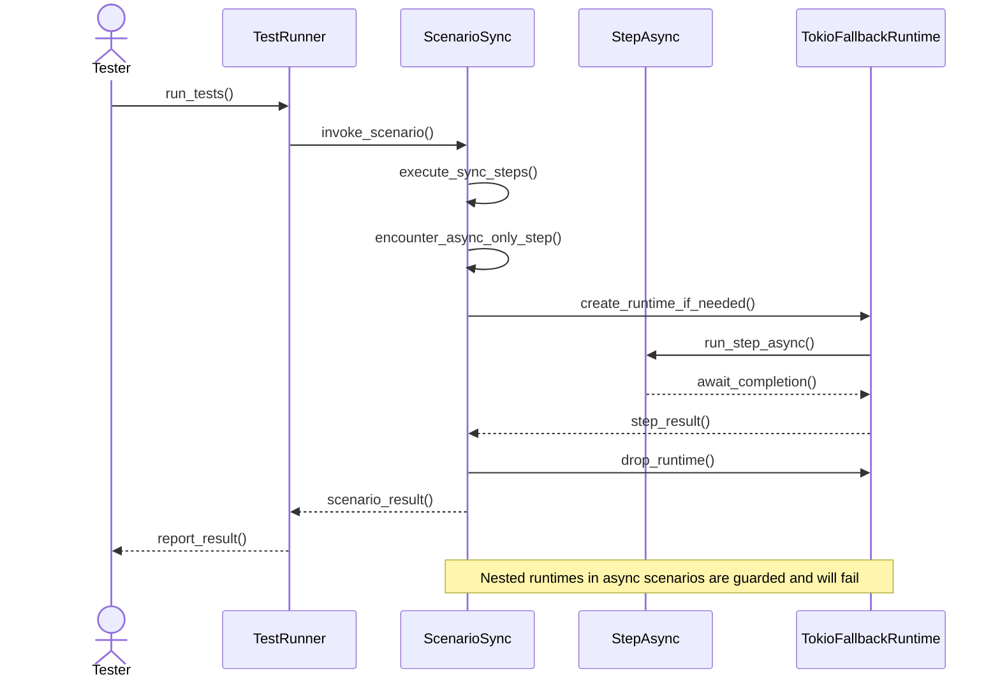

# `rstest-bdd` user's guide

## Introduction

Behaviour‑Driven Development (BDD) is a collaborative practice that emphasizes
a shared understanding of software behaviour across roles. The design of
`rstest‑bdd` integrates BDD concepts with the Rust testing ecosystem. BDD
encourages collaboration between developers, quality-assurance specialists, and
non-technical business participants by describing system behaviour in a
natural, domain‑specific language. `rstest‑bdd` achieves this without
introducing a bespoke test runner; instead, it builds on the `rstest` crate so
that unit tests and high‑level behaviour tests can co‑exist and run under
`cargo test`. The framework reuses `rstest` fixtures for dependency injection
and uses a procedural macro to bind tests to Gherkin scenarios, ensuring that
functional tests live alongside unit tests and benefit from the same tooling.

This guide explains how to consume `rstest‑bdd` at the current stage of
development. It relies on the implemented code rather than on aspirational
features described in the design documents. Where the design proposes advanced
behaviour, the implementation status is noted. Examples and explanations are
organized by the so‑called *three amigos* of BDD: the business analyst/product
owner, the developer, and the tester.

## Toolchain requirements

`rstest-bdd` targets Rust 1.88 or newer across every crate in the workspace.
Each `Cargo.toml` declares `rust-version = "1.88"`, so `cargo` will refuse to
compile the project on older compilers. The workspace uses the Rust 2024
edition.

`rstest-bdd` builds, tests, and lints on stable Rust. The repository pins that
toolchain through `rust-toolchain.toml`, so ordinary `cargo` and Clippy
commands use stable Rust.

### Formatting toolchain

The workspace's `.rustfmt.toml` uses unstable formatting options. `make fmt` and
`make check-fmt` therefore select the dated nightly formatter named by
`FMT_TOOLCHAIN` in the Makefile, while every other Cargo invocation stays on
stable. Install the matching formatter after installing the stable toolchain:

```sh
rustup toolchain install nightly-2026-08-07 --profile minimal --component rustfmt
```

Use `make fmt` rather than stable `cargo fmt`. Configure editor format-on-save
to invoke `rustup run nightly-2026-08-07 rustfmt`, with any editor-specific
arguments needed to pass the current file on standard input and read the
formatted output from standard output. For rust-analyzer clients, set
`rust-analyzer.rustfmt.overrideCommand` to that command array. This keeps local
edits aligned with `make check-fmt` and CI.

Step definitions may be synchronous functions (`fn`) or asynchronous functions (
`async fn`). The framework no longer depends on the `async-trait` crate to
express async methods in traits. Projects that previously relied on
`#[async_trait]` in helper traits should replace those methods with ordinary
functions, and use async steps or async fixtures where appropriate. Step
wrappers normalize results into `StepExecution`.

## The three amigos

| Role ("amigo")                     | Primary concerns                                                                                                                  | Features provided by `rstest‑bdd`                                                                                                                                                                                                                                                                                                                                                                         |
| ---------------------------------- | --------------------------------------------------------------------------------------------------------------------------------- | --------------------------------------------------------------------------------------------------------------------------------------------------------------------------------------------------------------------------------------------------------------------------------------------------------------------------------------------------------------------------------------------------------- |
| **Business analyst/product owner** | Writing and reviewing business-readable specifications; ensuring that acceptance criteria are expressed clearly.                  | Gherkin `.feature` files are plain text and start with a `Feature` declaration; each `Scenario` describes a single behaviour. Steps are written using keywords `Given`, `When`, and `Then` ([syntax][gherkin-syntax]), producing living documentation that can be read by non-technical stakeholders.                                                                                                     |
| **Developer**                      | Implementing step definitions in Rust and wiring them to the business specifications; using existing fixtures for setup/teardown. | Attribute macros `#[given]`, `#[when]` and `#[then]` register step functions and their pattern strings in a global step registry. A `#[scenario]` macro reads a feature file at compile time and generates a test that drives the registered steps. Fixtures whose parameter names match are injected automatically; use `#[from(name)]` only when a parameter name differs from the fixture.             |
| **Tester/QA**                      | Executing behaviour tests, ensuring correct sequencing of steps and verifying outcomes observable by the user.                    | Scenarios are executed via the standard `cargo test` runner; test functions annotated with `#[scenario]` run each step in order and panic if a step is missing. Assertions belong in `Then` steps; guidelines discourage inspecting internal state and encourage verifying observable outcomes. Testers can use `cargo test` filters and parallelism because the generated tests are ordinary Rust tests. |

The following sections expand on these responsibilities and show how to use the
current API effectively.

## Gherkin feature files

Gherkin files describe behaviour in a structured, plain‑text format that can be
read by both technical and non‑technical stakeholders. Each `.feature` file
begins with a `Feature` declaration that provides a high‑level description of
the functionality. A feature contains one or more `Scenario` sections, each of
which documents a single example of system behaviour. Inside a scenario, the
behaviour is expressed through a sequence of steps starting with `Given`
(context), followed by `When` (action) and ending with `Then` (expected
outcome). Secondary keywords `And` and `But` may chain additional steps of the
same type for readability.

Scenarios follow the simple `Given‑When‑Then` pattern. Support for **Scenario
Outline** is available, enabling a single scenario to run with multiple sets of
data from an `Examples` table. A `Background` section defines steps that run
before each `Scenario` in a feature file, enabling shared setup across
scenarios. Advanced constructs such as data tables and doc strings provide
structured or free‑form arguments to steps.

### Example feature file

```gherkin
Feature: Shopping basket

  Scenario: Add item to basket
    Given an empty basket
    When the user adds a pumpkin
    Then the basket contains one pumpkin
```

The feature file lives within the crate (commonly under `tests/features/`). The
path to this file will be referenced by the `#[scenario]` macro in the test
code.

### Internationalized scenarios

`rstest-bdd` reads the optional `# language: <code>` directive that appears at
the top of a feature file. When a locale is specified, the parser uses that
language's keyword catalogue, enabling teams to collaborate in their native
language. The `examples/japanese-ledger` crate demonstrates the end-to-end
workflow for Japanese:

```gherkin
# language: ja
フィーチャ: 家計簿の残高を管理する
  シナリオ: 収入を記録する
    前提 残高は0である
    もし 残高に5を加える
    ならば 残高は5である
```

Step definitions use the same Unicode phrases:

```rust,no_run
use japanese_ledger::HouseholdLedger;
use rstest_bdd_macros::{given, when, then};

#[given("残高は{start:i32}である")]
fn starting_balance(ledger: &HouseholdLedger, start: i32) {
    ledger.set_balance(start);
}
```

Running `cargo test -p japanese-ledger` executes both Japanese scenarios. The
full source lives under `examples/japanese-ledger/` for teams that want to copy
the structure into their projects.

## Step definitions

Developers implement the behaviour described in a feature by writing step
definition functions in Rust. Each step definition is an ordinary function
annotated with one of the attribute macros `#[given]`, `#[when]` or `#[then]`.
The annotation takes a single string literal that must match the text of the
corresponding step in the feature file. Placeholders in the form `{name}` or
`{name:Type}` are supported. The framework extracts matching substrings and
converts them using `FromStr`; type hints constrain the match using specialized
regular expressions. If the step text does not supply a capture for a declared
argument, the wrapper panics with
`pattern '<pattern>' missing capture for argument '<name>'`, making the
mismatch explicit.

For cucumber-rs migration compatibility notes, see
[Migration and async patterns][migration-async-patterns].

The procedural macro implementation expands the annotated function into two
parts: the original function and a wrapper function that registers the step in
a global registry. The wrapper captures the step keyword, pattern string and
associated fixtures and uses the `inventory` crate to publish them for later
lookup.

### Fixtures and implicit injection

`rstest‑bdd` builds on `rstest`’s fixture system rather than using a monolithic
“world” object. Fixtures are defined using `#[rstest::fixture]` in the usual
way. When a step function parameter does not correspond to a placeholder in the
step pattern, the macros treat it as a fixture and inject the value
automatically. The optional `#[from(name)]` attribute remains available when a
parameter name must differ from the fixture. Importing a symbol of the same
name is not required; do not alias a function or item just to satisfy the
compiler. Only the key stored in `StepContext` must match.

Implicit fixture keys derived from scenario and step parameter names normalize
at most one leading underscore. In practice, `world` and `_world` both resolve
to the implicit fixture key `world`, while `__world` resolves to `_world`.
Explicit `#[from(...)]` names remain exact and bypass this normalization, so
`#[from(_world)]` still requests the literal `_world` fixture key.

#### Supported `#[from]` forms

For the harness context specifically, prefer the `#[harness_context]` marker
described under "Harness adapter and attribute policy" — it names intent rather
than the internal fixture key. `#[from(rstest_bdd_harness_context)]` remains
supported.

`#[from]` selects which fixture key a parameter binds to. It accepts either no
arguments or exactly one identifier in parentheses:

```rust,no_run
#[given("the catalogue is loaded")]
fn catalogue_loaded(
    // Named: binds the `db_pool` fixture to a differently named parameter.
    #[from(db_pool)] pool: DbPool,
    // Bare: binds the fixture named after the parameter itself, `cache`.
    #[from] cache: Cache,
) {}
```

`#[from(name)]` requests the fixture key `name` exactly. Use it when the
parameter cannot carry the fixture's own name — because that name is already
taken at the call site, or because a shorter local name reads better.

Bare `#[from]` requests the parameter's own normalized fixture name, which is
what an unannotated parameter already does. It changes no lookup, so its
purpose is documentary: it marks a parameter as a deliberate fixture injection
at the binding site, rather than leaving a reader to infer that from the
absence of a matching placeholder in the step pattern.

Two spellings are rejected when the macro expands.

The name-value form is invalid, because `from` takes either no arguments or one
parenthesized identifier and never `= value`:

```text
error: invalid step function signature: #[from] expects an identifier or no arguments
```

Rewrite `#[from = "db_pool"]` as `#[from(db_pool)]`.

More than one `#[from]` on the same parameter is also invalid, including a
mixture of the bare and named forms, because the second would silently displace
the first:

```text
error: invalid step function signature: duplicate `#[from]` attribute

         = help: Remove one of the duplicate `#[from]` attributes.
```

Keep the single attribute naming the intended fixture and delete the others.

Internally, the step macros record the fixture names and generate wrapper code
that, at runtime, retrieves references from a `StepContext`. This context is a
key–value map of fixture names to type‑erased references. When a scenario runs,
the generated test inserts its arguments (the `rstest` fixtures) into the
`StepContext` before invoking each registered step.

If a required fixture is not present, the runtime diagnostic lists the missing
fixture name, the Rust type requested by the step, and the fixture keys already
inserted into the scenario context. For harness context specifically, a missing
`rstest_bdd_harness_context` fixture also includes a hint to select a
harness-backed scenario so the reserved context fixture is inserted.

### Mutable world fixtures

Each scenario owns its fixtures, so value fixtures are stored with exclusive
access. Step parameters declared as `&mut FixtureType` receive mutable
references, making “world” structs ergonomic without sprinkling `Cell` or
`RefCell` wrappers through the fields. Immutable references continue to work
exactly as before; mutability is an opt‑in convenience.

**When to use `&mut Fixture`**

- Prefer `&mut` when the world has straightforward owned fields and the steps
  mutate them directly.
- Prefer `Slot<T>` (from `rstest_bdd::Slot`) when state is optional, when a
  need to reset between steps, or when a step may override values conditionally
  without holding a mutable borrow.
- Combine both: keep the primary world mutable and store optional or
  late‑bound values in slots to avoid borrow checker churn inside complex
  scenarios.

#### Simple mutable world

```rust,no_run
use rstest::fixture;
use rstest_bdd_macros::{given, scenario, then, when};

#[derive(Default)]
struct CounterWorld {
    count: usize,
}

#[fixture]
fn world() -> CounterWorld {
    CounterWorld::default()
}

#[given("the world starts at {value}")]
fn seed(world: &mut CounterWorld, value: usize) {
    world.count = value;
}

#[when("the world increments")]
fn increment(world: &mut CounterWorld) {
    world.count += 1;
}

#[then("the world equals {expected}")]
fn check(world: &CounterWorld, expected: usize) {
    assert_eq!(world.count, expected);
}

#[scenario(path = "tests/features/mutable_world.feature", name = "Steps mutate shared state")]
fn mutable_world(world: CounterWorld) {
    assert_eq!(world.count, 3);
}
```

#### Recording overrides directly with `insert_value`

The automatic injection above is implemented on top of a lower-level API that
advanced tests may call directly. `StepContext::insert_value` records a
step-return override and returns an `InsertOutcome`, which distinguishes the
three results a bare `Option` previously conflated:

- `InsertOutcome::Inserted(previous)` — a fixture uniquely matched the value's
  type and the override was recorded. `previous` is `Some(_)` when it displaced
  an earlier override for that fixture, or `None` otherwise.
- `InsertOutcome::NoMatch` — no fixture uses the value's type, so the value was
  dropped.
- `InsertOutcome::AmbiguousIgnored` — more than one fixture matches the value's
  type, so the value was dropped to avoid an ambiguous override (a warning is
  emitted).

The warning is emitted as a `tracing::warn!` event under the target
`rstest_bdd::context`. A `tracing` subscriber receives it when it accepts
`WARN`; otherwise, if no `tracing` dispatcher was ever installed and a `log`
logger (such as `env_logger`) accepts `WARN` for that target, the warning is
delivered through `tracing`'s log bridge. If neither route has a listener, the
message is mirrored to stderr so it remains visible in a test binary with no
logging configured.

`InsertOutcome` is `#[must_use]`, so the compiler warns when a direct caller
implicitly discards it and might miss a dropped step return; an explicit
`let _ = ctx.insert_value(…)` still suppresses that warning, as the generated
scenario runner does. Callers that need only the displaced previous override —
the value the old `Option<Box<dyn Any>>`-returning API yielded — can call
`InsertOutcome::into_previous()`, which returns the previous override for the
`Inserted` case and `None` for `NoMatch` and `AmbiguousIgnored`.
`InsertOutcome::is_inserted()` reports whether the override was recorded
without consuming the outcome.

#### Slot‑based state (unchanged and still useful)

```rust,no_run
use rstest::fixture;
use rstest_bdd::{ScenarioState as _, Slot};
use rstest_bdd_macros::{given, scenario, then, when, ScenarioState};

#[derive(Default, ScenarioState)]
struct CartState {
    total: Slot<i32>,
}

#[fixture]
fn cart_state() -> CartState { CartState::default() }

#[when("I record {value:i32}")]
fn record(cart_state: &CartState, value: i32) { cart_state.total.set(value); }

#[then("the recorded value is {expected:i32}")]
fn check(cart_state: &CartState, expected: i32) {
    assert_eq!(cart_state.total.get(), Some(expected));
}

#[scenario(path = "tests/features/scenario_state.feature", name = "Recording a single value")]
fn keeps_value(_cart_state: CartState) {}
```

#### Mixed approach

```rust,no_run
#[derive(Default, ScenarioState)]
struct ReportWorld {
    total: usize,
    last_input: Slot<String>,
}

#[when("the total increases by {value:usize}")]
fn bump(world: &mut ReportWorld, value: usize) {
    world.total += value;
    world.last_input.set(format!("+{value}"));
}

#[then("the last input was recorded")]
fn last_input(world: &ReportWorld) {
    assert_eq!(world.last_input.get(), Some("+1".to_string()));
}
```

#### Best practices

- Keep world structs small and focused; extract helper methods when mutation
  requires validation or cross‑field consistency.
- Prefer immutable references in assertions to make read‑only intent obvious.
- Reserve `Slot<T>` for optional or resettable state; avoid mixing it in when a
  plain field would do.
- Add comments where mutation order matters between steps.

#### Troubleshooting

- A rustc internal compiler error (ICE) affected some nightly compilers when
  expanding macro‑driven scenarios with `&mut` fixtures. See
  `crates/rstest-bdd/tests/mutable_world_macro.rs` for a guarded example and
  `crates/rstest-bdd/tests/mutable_fixture.rs` for the context‑level regression
  test used until the upstream fix lands. Tracking details live in
  `docs/known-issues.md#rustc-internal-compiler-error-ice-with-mutable-world-macro`.
- For advanced cases—custom fixture injection or manual borrowing—use
  `StepContext::insert_owned` and `StepContext::borrow_mut` directly; the
  examples above cover most scenarios.

### Step return values

`#[when]` steps may return a value. The scenario runner scans the available
fixtures for ones whose `TypeId` matches the returned value. When exactly one
fixture uses that type, the override is recorded under that fixture’s name and
subsequent steps receive the most recent value (last write wins). Ambiguous or
missing matches leave fixtures untouched, keeping scenarios predictable while
still allowing a functional style without mutable fixtures.

Steps may also return `Result<T, E>`. An `Err` aborts the scenario, while an
`Ok` value is injected as above.

Unhinted non-unit steps are classified by their concrete return type. This
includes local aliases: an alias of `Result<T, E>` propagates `Err` and injects
the `T` from `Ok(T)`, while a genuine value alias remains a payload. A result
containing wrapper such as `Box<Result<T, E>>`, `Option<Result<T, E>>`, or
`&Result<T, E>` remains a value; the framework does not unwrap user types.

Use `#[when(result)]` only to force a fallible interpretation for an ambiguous
form. It is rejected for primitive return types. When used with an alias, the
compiler verifies that the alias is ultimately `Result`-like. Use
`#[when(value)]` only when a real `Result` is intentionally the payload,
because it suppresses that result's `Err`.

Use `#[when("...", value)]` (or `#[when(value)]` when using the inferred
pattern) to force treating the return value as a payload even when it is
`Result<..>`.

Returning `()` or `Ok(())` produces no stored value, so fixtures of `()` are
not overwritten.

```rust,no_run
use rstest::fixture;
use rstest_bdd_macros::{given, when, then, scenario};

#[fixture]
fn number() -> i32 { 1 }

#[when("it is incremented")]
fn increment(number: i32) -> i32 { number + 1 }

#[then("the result is 2")]
fn check(number: i32) { assert_eq!(number, 2); }

#[scenario(path = "tests/features/step_return.feature")]
fn returns_value(number: i32) { let _ = number; }
```

### Struct-based step arguments

When a step pattern contains several placeholders, the corresponding function
signatures quickly become unwieldy. Derive the `StepArgs` trait for a struct
whose fields mirror the placeholders and annotate the relevant parameter with
`#[step_args]` to request struct-based parsing. The attribute tells the macro
to consume every placeholder for that parameter, while fixtures and other
special arguments (`datatable`/`docstring`) continue to work as usual.

Fields must implement `FromStr`, and the derive macro enforces the bounds
automatically. Placeholders and struct fields must appear in the same order.
During expansion the macro inserts a compile-time check to ensure the field
count matches the pattern, producing a trait-bound error if the struct does not
implement `StepArgs`.

```rust,no_run
use rstest::fixture;
use rstest_bdd_macros::{given, scenario, then, when, StepArgs};

#[derive(StepArgs)]
struct CartInput {
    quantity: u32,
    item: String,
    price: f32,
}

#[derive(Default)]
struct Cart {
    quantity: u32,
    item: String,
    price: f32,
}

impl Cart {
    fn set(&mut self, details: &CartInput) {
        self.quantity = details.quantity;
        self.item = details.item.clone();
        self.price = details.price;
    }
}

#[fixture]
fn cart() -> Cart { Cart::default() }

#[given("a cart containing {quantity:u32} {item} at ${price:f32}")]
fn seed_cart(#[step_args] details: CartInput, cart: &mut Cart) {
    cart.set(&details);
}

#[then("the cart summary shows {quantity:u32} {item} at ${price:f32}")]
fn cart_summary(#[step_args] expected: CartInput, cart: &Cart) {
    assert_eq!(cart.quantity, expected.quantity);
    assert_eq!(cart.item, expected.item);
    assert!((cart.price - expected.price).abs() < f32::EPSILON);
}
```

`#[step_args]` must not be combined with `#[from]` and cannot target reference
types because the macro needs to own the struct to parse it. Attempting to use
multiple `#[step_args]` parameters in a single step yields a compile-time
error. The compiler also surfaces an error when the step pattern does not
declare any placeholders.

Example:

```rust,no_run
use rstest::fixture;
use rstest_bdd_macros::{given, when, then, scenario};

// A fixture used by multiple steps.
#[fixture]
fn basket() -> Basket {
    Basket::new()
}

#[given("an empty basket")]
fn empty_basket(basket: &mut Basket) {
    basket.clear();
}

#[when("the user adds a pumpkin")]
fn add_pumpkin(basket: &mut Basket) {
    basket.add(Item::Pumpkin, 1);
}

#[then("the basket contains one pumpkin")]
fn assert_pumpkins(basket: &Basket) {
    assert_eq!(basket.count(Item::Pumpkin), 1);
}

#[scenario(path = "tests/features/shopping.feature")]
fn test_add_to_basket(#[with(basket)] _: Basket) {
    // optional assertions after the steps
}
```

### Scenario state slots

Complex scenarios often need to capture intermediate results or share mutable
state between multiple steps. Historically, this required wrapping every field
in `RefCell<Option<T>>`, introducing noise and risking forgotten resets. The
`rstest-bdd` runtime now provides `Slot<T>`, a thin wrapper that exposes a
focused API for populating, reading, and clearing per-scenario values. Each
slot starts empty and supports helpers such as `set`, `replace`,
`get_or_insert_with`, `take`, and predicates `is_empty`/`is_filled`.

Define a state struct whose fields are `Slot<T>` and derive [`ScenarioState`].
The derive macro clears every slot by implementing `ScenarioState::reset` and
it automatically adds a [`Default`] implementation that leaves all slots empty.
**Do not** also derive or implement `Default`: Rust will report a
duplicate-implementation error because the macro already provides it. For
custom initialization, plan to use the future `#[scenario_state(no_default)]`
flag (or equivalent) to opt out of the generated `Default` and supply bespoke
logic.

```rust,no_run
use rstest::fixture;
use rstest_bdd::{ScenarioState, Slot};
use rstest_bdd_macros::{given, scenario, then, when, ScenarioState};

#[derive(ScenarioState)]
struct CliState {
    output: Slot<String>,
    exit_code: Slot<i32>,
}

#[fixture]
fn cli_state() -> CliState {
    CliState::default()
}

#[when("I run the CLI with {word}")]
fn run_command(cli_state: &CliState, argument: String) {
    let result = format!("ran {argument}");
    cli_state.output.set(result);
    cli_state.exit_code.set(0);
}

#[then("the CLI succeeded")]
fn cli_succeeded(cli_state: &CliState) {
    assert_eq!(cli_state.exit_code.get(), Some(0));
}

#[then("I can reset the state")]
fn reset_state(cli_state: &CliState) {
    cli_state.reset();
    assert!(cli_state.output.is_empty());
}

#[scenario(path = "tests/features/cli.feature")]
fn cli_behaviour(_cli_state: CliState) {}
```

Slots are independent, so scenarios can freely mix eager `set` calls with lazy
`get_or_insert_with` initializers. Because slots live inside a regular fixture,
the state benefits from `rstest`’s usual lifecycle: a fresh struct is produced
for each scenario invocation, yet it remains trivial to clear and reuse the
contents when chaining multiple behaviours inside a single test body.

### Implicit fixture injection

Implicit fixtures such as `basket` must already be in scope in the test module;
`#[from(name)]` only renames a fixture and does not create one.

In this example, the step texts in the annotations must match the feature file
verbatim. The `#[scenario]` macro binds the test function to the first scenario
in the specified feature file and runs all registered steps before executing
the body of `test_add_to_basket`.

### Inferred step patterns

Step macros may omit the pattern string or provide a string literal containing
only whitespace. In either case, the macro derives a pattern from the function
name by replacing underscores with spaces.

```rust,no_run
use rstest_bdd_macros::given;

#[given]
fn user_logs_in() {
    // pattern "user logs in" is inferred
}
```

This reduces duplication between function names and patterns. A literal `""`
registers an empty pattern instead of inferring one.

> Note
> Inference preserves spaces derived from underscores:
>
> - Leading and trailing underscores become leading or trailing spaces.
> - Consecutive underscores become multiple spaces.
> - Letter case is preserved.

## State management across scenarios

Teams coming from cucumber-rs often ask where the shared `World` lives in
`rstest-bdd`. The short answer is: **fixtures are the world**, and scenario
isolation is the default.

Each `#[scenario]` expansion produces an ordinary Rust test. `rstest` builds
fresh fixture values for each test invocation, unless a different lifetime is
opted into, such as `#[once]`. `StepContext` is also created per scenario run,
so state mutated in one scenario is not automatically visible in another.

This design keeps scenarios independent, allows parallel execution, and avoids
order-dependent failures.

### Isolation defaults and what can be shared

- **Default behaviour:** every scenario receives fresh fixture instances.
- **Within one scenario:** use `&mut Fixture` or `Slot<T>` to share mutable
  state across steps.
- **Across scenarios:** share infrastructure (for example a database pool) and
  recreate scenario data from that infrastructure in each scenario.
- **Opt-in global sharing:** use `#[once]` fixtures only for expensive,
  effectively read-only resources; mutable process-global state introduces
  coupling and ordering hazards.

### Worked example: user management with a shared pool

The feature below reflects a common migration request. The second scenario does
not rely on step side effects from the first scenario; it states its own setup.

```gherkin
Feature: User management

  Scenario: Create user
    Given a database connection
    When user "alice" is created
    Then user "alice" exists

  Scenario: Update user
    Given a database connection
    And user "alice" exists
    When user "alice" is updated
    Then the update succeeds
```

```rust,no_run
use rstest::fixture;
use rstest_bdd_macros::{given, scenario, then, when};
use std::sync::OnceLock;

struct DbPool;
struct ScenarioDb;

impl DbPool {
    fn connect() -> Self { Self }
    fn begin_scenario(&'static self) -> ScenarioDb { ScenarioDb }
}

impl ScenarioDb {
    fn create_user(&mut self, _name: &str) {}
    fn ensure_user(&mut self, _name: &str) {}
    fn update_user(&mut self, _name: &str) {}
    fn has_user(&self, _name: &str) -> bool { true }
    fn last_update_succeeded(&self) -> bool { true }
}

#[fixture]
#[once]
fn db_pool() -> &'static DbPool {
    static POOL: OnceLock<DbPool> = OnceLock::new();
    POOL.get_or_init(DbPool::connect)
}

#[fixture]
fn scenario_db(db_pool: &'static DbPool) -> ScenarioDb {
    db_pool.begin_scenario()
}

#[given("a database connection")]
fn database_connection(_scenario_db: &ScenarioDb) {}

#[given("user {name} exists")]
fn user_exists(scenario_db: &mut ScenarioDb, name: String) {
    scenario_db.ensure_user(&name);
}

#[when("user {name} is created")]
fn create_user(scenario_db: &mut ScenarioDb, name: String) {
    scenario_db.create_user(&name);
}

#[when("user {name} is updated")]
fn update_user(scenario_db: &mut ScenarioDb, name: String) {
    scenario_db.update_user(&name);
}

#[then("user {name} exists")]
fn assert_user_exists(scenario_db: &ScenarioDb, name: String) {
    assert!(scenario_db.has_user(&name));
}

#[then("the update succeeds")]
fn assert_update_succeeds(scenario_db: &ScenarioDb) {
    assert!(scenario_db.last_update_succeeded());
}

#[scenario(path = "tests/features/user_management.feature", name = "Create user")]
fn create_user_scenario(scenario_db: ScenarioDb) {
    let _ = scenario_db;
}

#[scenario(path = "tests/features/user_management.feature", name = "Update user")]
fn update_user_scenario(scenario_db: ScenarioDb) {
    let _ = scenario_db;
}
```

In this pattern:

- `db_pool` is shared across scenarios (`#[once]`).
- `scenario_db` is recreated per scenario (isolation boundary).
- `Given a database connection` binds the scenario-scoped `scenario_db`
  fixture; the shared `db_pool` remains an infrastructure dependency.
- The update scenario declares its own precondition (`user {name} exists`)
  rather than depending on `Create user` running first.

### `StepContext::insert_owned` and manual mutable sharing

Most suites should not call `StepContext::insert_owned` directly. The generated
`#[scenario]` glue already inserts fixtures for the scenario function and
supports `&mut Fixture` step parameters.

`StepContext::owned_cell` creates the type-erased mutable storage required by
`insert_owned`.

Use `insert_owned` only when building custom step-execution plumbing outside
the usual macros and registering a mutable fixture manually:

```rust,no_run
use rstest_bdd::StepContext;

#[derive(Default)]
struct World {
    count: usize,
}

let mut ctx = StepContext::default();
let world = StepContext::owned_cell(World::default());
ctx.insert_owned::<World>("world", &world);
```

### Borrowing fixtures from `StepContext`

Custom step-execution plumbing can borrow fixtures through `&StepContext`.
`try_borrow` returns an opaque `FixtureRef<T>` for shared access, while
`try_borrow_mut` returns an opaque `FixtureRefMut<T>` for mutable access.
Borrow state is tracked per fixture, so mutable guards for distinct fixtures
can be held concurrently:

```rust,no_run
use rstest_bdd::{FixtureBorrowError, StepContext};

# fn main() -> Result<(), FixtureBorrowError> {
let mut ctx = StepContext::default();
let counter = StepContext::owned_cell(1_u32);
let label = StepContext::owned_cell(String::from("ready"));
ctx.insert_owned::<u32>("counter", &counter);
ctx.insert_owned::<String>("label", &label);

let mut counter_guard = ctx.try_borrow_mut::<u32>("counter")?;
let mut label_guard = ctx.try_borrow_mut::<String>("label")?;
*counter_guard += 1;
label_guard.push('!');
drop(counter_guard);
drop(label_guard);

assert_eq!(*ctx.try_borrow::<u32>("counter")?, 2);

let original = 3_u64;
ctx.insert("number", &original);
let outcome = ctx.insert_value(Box::new(7_u64));
assert!(outcome.is_inserted());
assert_eq!(*ctx.try_borrow::<u64>("number")?, 7);
assert_eq!(ctx.get::<u64>("number"), Some(&3));
# Ok(())
# }
```

Step-returned overrides take precedence in `try_borrow` and `try_borrow_mut`.
The older `get` lookup deliberately ignores override storage and reads shared
fixtures only, as the final two assertions show. The `borrow_ref` and
`borrow_mut` conveniences expose the same guards as `Option`; use the `try_*`
forms when the failure reason matters.

`FixtureBorrowError` distinguishes `NotFound`, `TypeMismatch`,
`AlreadyBorrowed`, and `NotMutable`. `NotMutable` applies when mutable access
is requested for a fixture inserted by shared reference and no step-returned
override is available; conflicting guards for the same fixture produce
`AlreadyBorrowed` instead.

### Migration notes for cucumber-rs users

For migrations from a cucumber `World`, map the concepts as follows:

- **`World` struct:** use one or more `rstest` fixtures.
- **Mutable world during a scenario:** use `&mut FixtureType` in step
  signatures.
- **Optional/intermediate values:** use `Slot<T>` fields in a
  `#[derive(ScenarioState)]` fixture.
- **Global expensive setup:** use a narrowly scoped `#[once]` fixture returning
  shared infrastructure, then derive scenario-local state from it.

### Antipatterns to avoid

- Depending on scenario execution order (for example "Scenario B uses data from
  Scenario A") because test ordering is not guaranteed.
- Putting all mutable test data in a process-global static and mutating it from
  multiple scenarios.
- Using `#[once]` for resources that require deterministic teardown in `Drop`.
- Reusing one giant fixture for unrelated concerns instead of composing smaller
  fixtures.

## Binding tests to scenarios

The `#[scenario]` macro is the entry point that ties a Rust test function to a
scenario defined in a `.feature` file. It accepts six arguments:

| Argument           | Purpose                                                                | Status                                                                                                  |
| ------------------ | ---------------------------------------------------------------------- | ------------------------------------------------------------------------------------------------------- |
| `path: &str`       | Relative path to the feature file (required).                          | **Implemented**: resolved and parsed at macro-expansion time.                                           |
| `index: usize`     | Optional zero-based scenario index (defaults to `0`).                  | **Implemented**: selects the scenario by position.                                                      |
| `name: &str`       | Optional scenario title; resolves when unique.                         | **Implemented**: errors when missing and directs duplicates to `index`.                                 |
| `tags: &str`       | Optional tag-expression filter applied at expansion.                   | **Implemented**: filters scenarios and outline example rows; errors when nothing matches.               |
| `harness: Path`    | Optional harness adapter type implementing `HarnessAdapter + Default`. | **Implemented**: emits trait-bound assertions and delegates execution when specified.                   |
| `attributes: Path` | Optional attribute policy type implementing `AttributePolicy`.         | **Implemented**: emits a compile-time trait-bound assertion and resolves policy-backed test attributes. |

Tag filters run at macro-expansion time against the union of tags on the
feature, the matched scenario, and—when dealing with `Scenario Outline`—the
`Examples:` block that produced each generated row. Expressions support the
operators `and`, `or`, and `not` (case-insensitive) and respect the precedence
`not` > `and` > `or`; parentheses may be used to override this ordering. Tags
include the leading `@`. When the filter is combined with `index` or `name`,
the macro emits a compile error if the selected scenario does not satisfy the
expression.

### Harness adapter and attribute policy

The `harness` and `attributes` parameters accept Rust type paths pointing to
types that implement `HarnessAdapter` and `AttributePolicy` from the
`rstest-bdd-harness` crate. These enable third-party framework integrations
(per Architectural Decision Record (ADR-005a)) without coupling the core crates
to any specific runtime.

Use them in this order of preference:

- Omit both when the default synchronous `StdHarness` path is sufficient.
- For first-party integrations, prefer `harness = ...` on its own and let the
  macro infer the matching default attribute policy.
- Add `attributes = ...` only when overriding the inferred default or
  selecting an attribute policy without harness delegation.
- Treat `runtime = "tokio-current-thread"` as legacy compatibility syntax for
  `scenarios!`, not as the canonical configuration surface.

When `harness` is specified, the generated test body delegates scenario
execution through the harness adapter. The macro wraps the runtime portion of
the test (context setup, step executor loop, skip handler, and user block) in a
`ScenarioRunner` closure, constructs a `ScenarioRunRequest` with metadata
(feature path, scenario name, line number, and tags), and calls
`HarnessAdapter::run()`. The harness is instantiated via
`<HarnessType as Default>::default()`, so the harness type must implement both
`HarnessAdapter` and `Default`. The built-in `StdHarness` satisfies both
requirements and simply executes the closure directly. `StdHarness` behavioural
tests cover three guarantees: metadata remains visible on the request passed to
the harness boundary, the runner closure executes once, and runner panics
propagate unchanged. If a harness cannot initialize its runtime or framework
environment, it returns `HarnessResult::Err(HarnessError::...)`; the generated
test then panics with the concrete error detail because harness initialization
is a fatal infrastructure error in this context.

When `harness` is omitted, the generated code executes steps inline without any
delegation, preserving backward compatibility.

When `attributes` is specified, the macro resolves policy-backed test
attributes. Currently this resolution is path-based:

- `rstest_bdd_harness_tokio::TokioAttributePolicy`, or an imported
  `TokioAttributePolicy`, emits Tokio current-thread test attributes for async
  scenario signatures,
- `rstest_bdd_harness_gpui::GpuiAttributePolicy`, or an imported
  `GpuiAttributePolicy`, emits `#[gpui::test]` for synchronous and async
  scenario signatures, and
- default and unknown policy paths emit `#[rstest::rstest]` only.

Imported single-segment recognition only applies to unaliased first-party
names. If the adapter crates are renamed or aliased, or the policy types are
re-exported under different identifiers, use the canonical crate-root path (
`rstest_bdd_harness_tokio::TokioAttributePolicy` or
`rstest_bdd_harness_gpui::GpuiAttributePolicy`) or add a direct
`rstest-bdd-harness` dependency to get the same attribute recognition.

#### First-party adapter fallback diagnostics

The macros emit one diagnostic when an unresolved Tokio or GPUI adapter path
preserves the canonical first-party crate identifier immediately before the
adapter type, as in `alias::rstest_bdd_harness_tokio::TokioHarness`. This can
happen when a first-party adapter is re-exported through another module.
Nightly emits a native warning. Stable emits a deprecated-item warning by
default, and `#![deny(deprecated)]` escalates that diagnostic to an error.
Unrelated third-party paths such as `custom::TokioHarness` do not trigger the
diagnostic, even when the Tokio adapter crate is also a dependency.

The macro resolves each supplied adapter path once and emits at most one
diagnostic for that resolution. See the
[developers' guide][developers-guide-adapter-fallback] for the nightly and
stable implementation details.

Prefer the canonical paths:

- `rstest_bdd_harness_tokio::{TokioHarness, TokioAttributePolicy}`
- `rstest_bdd_harness_gpui::{GpuiHarness, GpuiAttributePolicy}`

If the adapter path must remain re-exported, add `rstest-bdd-harness` as a
direct development dependency under its canonical crate resolution name,
`rstest_bdd_harness`. Do not rename the dependency key: the generated fallback
code resolves `HarnessAdapter` and `AttributePolicy` through that exact crate
name rather than through the first-party adapter crate.

When `attributes` is omitted, known first-party harnesses infer matching
default attribute policies:

- `rstest_bdd_harness::StdHarness` resolves to rstest-only emission,
- `rstest_bdd_harness_tokio::TokioHarness`, or an imported `TokioHarness`,
  resolves to the Tokio current-thread policy, and
- `rstest_bdd_harness_gpui::GpuiHarness`, or an imported `GpuiHarness`,
  resolves to the GPUI test policy.

If the harness path is not one of those known first-party paths, the macro
falls back to the existing `RuntimeMode` compatibility behaviour. This keeps
the first-party Tokio compatibility path working while leaving third-party
policy resolution explicit about its current limitation: arbitrary user-defined
`AttributePolicy::test_attributes()` implementations are not evaluated during
macro expansion.

In simple terms, attribute selection works like this:

1. If `attributes = ...` is present, that explicit policy wins.
2. Otherwise, if `harness = ...` names `StdHarness`, `TokioHarness`, or
   `GpuiHarness`, the macro uses that harness's first-party default policy.
3. Otherwise, `scenarios!` keeps honouring the legacy
   `runtime = "tokio-current-thread"` compatibility alias when no explicit
   attributes or harness were selected.
4. Otherwise, if the `#[scenario]` function is `async fn`, the macro emits
   `#[rstest::rstest]` and `#[tokio::test(flavor = "current_thread")]` (unless
   the user already supplies a `#[tokio::test]` attribute, in which case
   deduplication suppresses the second copy).
5. If none of those apply, the macro emits the normal synchronous
   `#[rstest::rstest]` attribute set.

#### Third-party harness adapter cookbook

A separate harness crate is appropriate when a framework needs setup, teardown,
runtime ownership, or typed context that should not become a dependency of the
core `rstest-bdd` crates. A Bevy integration, for example, should live in an
opt-in crate such as `rstest-bdd-harness-bevy` and expose two public types:

- a harness adapter, such as `BevyHarness`, implementing `HarnessAdapter`; and
- an optional attribute policy, such as `BevyAttributePolicy`, implementing
  `AttributePolicy`.

The adapter crate depends on the shared harness contract and on the framework
it integrates. In a real crate, the framework version should match the
application, and that configuration should stay out of `rstest-bdd` itself:

```toml
[package]
name = "rstest-bdd-harness-bevy"
version = "0.6.0"
edition = "2024"

[dependencies]
bevy = { version = "0.14", default-features = false }
rstest-bdd-harness = "0.6.0"

[dev-dependencies]
rstest-bdd = "0.6.0"
rstest-bdd-macros = "0.6.0"
```

The harness type must implement `Default` because generated scenario tests
instantiate it with `<Harness as Default>::default()`. It must also set the
associated `Context` type and run the scenario by passing a concrete context
value into `request.run(context)`. For a Bevy-like harness, that context would
normally be a `bevy::ecs::world::World` or a small wrapper around it:

```rust,no_run
use bevy::ecs::world::World;
use bevy::prelude::Resource;
use rstest_bdd_harness::{HarnessAdapter, HarnessResult, ScenarioRunRequest};

#[derive(Default)]
pub struct BevyHarness;

impl HarnessAdapter for BevyHarness {
    type Context = World;

    fn run<T>(
        &self,
        request: ScenarioRunRequest<'_, Self::Context, T>,
    ) -> HarnessResult<T> {
        let mut world = World::new();

        // Register test-only resources, plugins, or schedules before steps run.
        world.insert_resource(TestClock::default());

        let result = request.run(world);

        // Run framework-specific cleanup here if the framework requires it.
        Ok(result)
    }
}

#[derive(Default, Resource)]
struct TestClock {
    ticks: u64,
}
```

Unit-context harnesses, where `type Context = ()`, should instead call
`request.run_without_context()`. Non-unit context harnesses must call
`request.run(context)`, otherwise step functions cannot borrow the context via
the reserved fixture key. If a step requests the reserved fixture but the
scenario did not run through a context-providing harness, the missing-fixture
error reports `rstest_bdd_harness_context`, the requested context type, the
fixtures that were inserted, and a hint to use a harness-backed scenario.

Step definitions request the harness context with the `#[harness_context]`
marker. The parameter name is adapter-specific; the underlying fixture key is
fixed:

```rust,no_run
use bevy::ecs::world::World;
use rstest_bdd_macros::{given, then, when};

#[given("the world starts empty")]
fn world_starts_empty(#[harness_context] world: &World) {
    assert_eq!(world.entities().len(), 0);
}

#[when("the app spawns one entity")]
fn app_spawns_one_entity(#[harness_context] world: &mut World) {
    world.spawn_empty();
}

#[then("the world contains one entity")]
fn world_contains_one_entity(#[harness_context] world: &World) {
    assert_eq!(world.entities().len(), 1);
}
```

Three spellings are accepted and generate identical code:

| Spelling                                      | When to use                                  |
| --------------------------------------------- | -------------------------------------------- |
| `#[harness_context] ctx: &T`                  | The default. Reads as intent, hides the key. |
| `ctx: &T` named `rstest_bdd_harness_context`  | Rarely; the name is unwieldy.                |
| `#[from(rstest_bdd_harness_context)] ctx: &T` | Existing v0.6.0 code; still supported.       |

*Table 2: Ways to request the harness context in a step definition.*

The `#[harness_context]` marker takes no arguments, may appear once per
parameter, and cannot be combined with `#[from]`, `#[datatable]`, or
`#[step_args]`.

The adapter may also publish an attribute policy. This keeps the framework's
native test attribute beside the harness crate instead of teaching the macro
crate about the framework dependency:

```rust,no_run
use rstest_bdd_harness::{AttributePolicy, TestAttribute};

pub struct BevyAttributePolicy;

const BEVY_TEST_ATTRIBUTES: [TestAttribute; 1] = [
    TestAttribute::new("rstest::rstest"),
];

impl AttributePolicy for BevyAttributePolicy {
    fn test_attributes() -> &'static [TestAttribute] {
        &BEVY_TEST_ATTRIBUTES
    }
}
```

At present, custom policy paths are checked for the `AttributePolicy` trait,
but their `test_attributes()` methods are not evaluated by the procedural
macros. Unknown third-party policy paths therefore fall back to
`#[rstest::rstest]` during code generation. The `attributes = ...`
configuration remains useful for the trait check and as a forward-compatible
configuration point. If a framework requires a native test attribute, that
attribute should be added explicitly until the policy resolver supports the
adapter crate.

The harness and policy can then be used from scenario tests like any other
macro configuration:

```rust,no_run
use rstest_bdd_macros::scenario;
use rstest_bdd_harness_bevy::{BevyAttributePolicy, BevyHarness};

#[scenario(
    path = "tests/features/bevy_world.feature",
    harness = BevyHarness,
    attributes = BevyAttributePolicy,
)]
fn bevy_world_scenario() {}
```

A minimal feature for the example above can stay framework-neutral:

```gherkin
Feature: Bevy world

  Scenario: Spawn an entity
    Given the world starts empty
    When the app spawns one entity
    Then the world contains one entity
```

The compile-checked mirror for this cookbook lives at
`crates/rstest-bdd/tests/fixtures_macros/scenario_third_party_harness_cookbook.rs`.
Maintainers should keep that fixture and the snippets above aligned when the
third-party harness contract changes.

Harness adapters must faithfully propagate the runner's return value inside
`Ok(...)`. For fallible scenarios that return `Result<(), E>`, swallowing
errors would cause tests to pass silently. Use `Err(HarnessError::...)` only
for harness-level infrastructure failures, not for scenario assertion failures.
When migrating pre-ADR-007 harness code, update `type Context`, the
`ScenarioRunner` constructor signature, and the request execution helper
together: unit-context harnesses (`StdHarness`, `TokioHarness`, and similar
adapters using `Context = ()`) should call `run_without_context()`, while
non-unit context harnesses should use `request.run(context)`.

For complete first-party examples, compare the `examples/tokio-reminders` and
`examples/gpui-counter` crates. They are not third-party templates, but they
show how an adapter crate keeps runtime or framework dependencies outside the
core runtime and macro crates.

### Using the Tokio harness

The `rstest-bdd-harness-tokio` crate provides a ready-made Tokio integration.
It is available as a dev-dependency:

```toml
[dev-dependencies]
rstest-bdd-harness-tokio = "0.6.0"
```

A direct `rstest-bdd-harness` dependency is not required when using
`TokioHarness` through this first-party adapter crate. Add the base harness
crate directly only when implementing a custom harness or importing base API
types such as `HarnessAdapter` or `ScenarioRunRequest`.

Generated asynchronous step wrappers obtain their runtime through the hidden
`rstest_bdd::__rstest_bdd_tokio` bridge. Consequently, a downstream crate does
not need a direct `tokio` dependency solely for generated wrappers; add one
when the crate's own code names Tokio APIs or attributes. The bridge is an
internal generated-code interface and downstream code must not call it directly.

`TokioHarness` can then be used directly in scenarios. For this first-party
adapter, the macro infers `TokioAttributePolicy` from the canonical harness
path when `attributes = ...` is omitted:

```rust,no_run
# use rstest_bdd_macros::scenario;
#[scenario(
    path = "tests/features/reminders.feature",
    name = "Scheduling a reminder queues it for later delivery",
    harness = rstest_bdd_harness_tokio::TokioHarness,
)]
fn queues_a_scheduled_reminder() {}
```

Keep explicit `attributes = ...` only for overrides, attributes-only tests, or
unrecognized paths where the default cannot be inferred.

### Using the GPUI harness

The `rstest-bdd-harness-gpui` crate provides Graphical Processing User
Interface (GPUI) integration for harness delegation and test attributes. Add it
as a dev-dependency:

```toml
[dev-dependencies]
rstest-bdd-harness-gpui = "0.6.0"
```

A direct `rstest-bdd-harness` dependency is not required when using
`GpuiHarness` through this first-party adapter crate. Add the base harness
crate directly only when implementing a custom harness or importing base API
types such as `HarnessAdapter` or `ScenarioRunRequest`.

`GpuiHarness` can then be used directly in scenarios. For this first-party
adapter, the macro infers `GpuiAttributePolicy` from the canonical harness path
when `attributes = ...` is omitted:

Fallible `#[scenario]` bodies are consumed behind a unit-returning GPUI test
boundary. An `Err` fails the test by panicking with the fixed message
`scenario returned an error`; the error value is not formatted and need not
implement `Debug`. Std and Tokio scenarios retain their fallible signatures and
propagate results through Rust's native `Termination` support.

```rust,no_run
# use rstest_bdd_macros::scenario;
# fn increment_counter() -> Result<(), std::io::Error> { Ok(()) }
#[scenario(
    path = "tests/features/counter.feature",
    name = "Increment a counter and observe GPUI context",
    harness = rstest_bdd_harness_gpui::GpuiHarness,
)]
fn increment_and_observe_gpui_context() -> Result<(), std::io::Error> {
    increment_counter()?;
    Ok(())
}
```

#### GPUI panic diagnostics carry scenario context

When a step running under `GpuiHarness` panics, the harness prepends the
feature path, scenario name, and feature-file line number to the panic message
before re-raising it through `panic::resume_unwind`. The same fields are
emitted as a `tracing::error!` record (`harness_type`, `feature_path`,
`scenario_name`, `scenario_line`) and as a matching `stderr` line, so test
runners that do not collect `tracing` events still surface the scenario name on
failure. This makes a failing GPUI scenario identifiable from the `cargo test`
or `cargo nextest` output without cross-referencing libtest function names
against feature files. For a concrete regression example, see
`crates/rstest-bdd-harness-gpui/tests/scenario_name_in_logs.rs`.

#### Stateful GPUI scenarios with durable handles

> **Note: this workaround is superseded from v0.7.0.**
>
> The thread-local scenario-state pattern below worked around the
> `StepContext::borrow_mut` contract in `rstest-bdd` 0.6.x (selected by
> [ADR-007][adr-007]), which prevented
> one step from borrowing two mutable fixtures (such as mutable harness
> context plus mutable world state) at once. From v0.7.0, fixture borrowing
> is guard-based ([ADR-012][adr-012]): steps can take `&mut` parameters for
> distinct fixtures — including
> `#[from(rstest_bdd_harness_context)] cx: &mut gpui::TestAppContext`
> alongside `world: &mut UiWorld` — and the framework builds a fresh
> `StepContext` for each scenario and drops its owned, scenario-scoped
> cells at the scenario boundary, so no thread-local reset discipline is
> required. Fixtures supplied by `rstest` keep their own scopes, so an
> `#[once]` fixture is still shared as `rstest` defines it. **New code
> should declare ordinary `&mut` fixture parameters instead of the
> pattern below.** The playbook is retained only for projects still on
> 0.6.x; migrate by moving thread-local state into an `rstest` fixture
> and deleting the reset calls.

<!-- -->

> **Which gpui does this playbook target?**
>
> The snippets below and the regression suite at
> `crates/rstest-bdd-harness-gpui/tests/stateful_window.rs` are written
> against the *vendored* gpui under `vendor/gpui`. Downstream crates using
> the *published* `gpui 0.2.2` on crates.io encounter a different test API.
> The four shapes that differ are:
>
> | Operation | Vendored gpui | Published `gpui 0.2.2` |
> | --- | --- | --- |
> | `add_window_view` | one-argument closure; returns `(Entity<T>, VisualTestContext)` | two-argument closure; returns `(Entity<V>, &mut VisualTestContext)` |
> | obtain window handle | `visual_cx.window_handle()` (inherent method on `VisualTestContext`) | `vcx.window_handle()` (same call, but `window_handle` is a `VisualContext` trait method, so add `use gpui::VisualContext;`) |
> | `from_window` | `Option<VisualTestContext>` | `VisualTestContext` |
> | read/update | `Option`/`Result` wrappers | direct `R` |
>
> *Table: Vendored-to-published gpui 0.2.2 API shape differences.*
>
> Adapt call sites when consuming the published crate. The harness itself
> (which only deals in `TestAppContext`) is not affected by this divergence.

#### When to reach for the stateful playbook

Stateful GPUI scenarios are those whose steps share durable resources, such as
a typed view entity and the window that owns it, and need mutable access to the
harness-provided `gpui::TestAppContext` as well. Scenarios that only read the
harness context, or that share state through ordinary
[`rstest`](https://docs.rs/rstest/) fixtures without also borrowing
`TestAppContext` mutably, should keep using plain fixtures and skip this
playbook. The pattern below is needed precisely when a single step must borrow
both `&mut TestAppContext` and shared mutable scenario state, which the v0.6
`StepContext` API cannot express in one borrow.

##### Durable handles versus visual context

`gpui::TestAppContext::add_window_view` creates a test window and returns the
typed view entity plus a visual context. The vendored fork returns
`(Entity<T>, VisualTestContext)` by value; published `gpui 0.2.2` returns
`(Entity<T>, &mut VisualTestContext)`. `Entity<T>` is the typed, durable handle
to the stored view, and `VisualTestContext::window_handle()` returns the
`AnyWindowHandle` that identifies the window itself. Both handles remain valid
across steps. `VisualTestContext`, by contrast, is tied to the `TestAppContext`
it was created against and must not be stored across steps: a later step
receives a fresh `&mut TestAppContext` from the harness. Stateful steps
therefore store `Entity<T>` and `AnyWindowHandle` only, and rebuild a fresh
`VisualTestContext` inside each step that needs visual interaction.

##### Reset protocol

Thread-local scenario state outlives any single scenario, so each scenario must
observe a two-sided reset protocol to prevent handle leakage across serial
scenarios on the same test thread:

- **Reset before assignment.** The first `#[given]` that opens a window
  resets the thread-local state before storing fresh handles. This makes a
  reused thread observe a clean slate even if the previous scenario aborted in
  a way that bypassed unwinding.
- **Reset after teardown.** A `Drop`-based fixture guard runs at scenario
  exit. Threading the guard through a `#[fixture]` ensures the reset runs on
  every unwind path: success, assertion failure, and panic alike.

Neither half is redundant. The constructor-side reset on the
`scenario_state_cleanup` fixture covers the case where a previous scenario
short-circuited (for example through `skip!`) or panicked in a way that
suppressed `Drop`. The `Drop` reset covers the symmetric case where the
*current* scenario panics and the next scenario's fixture is not yet
constructed when teardown happens. Deleting either call is a correctness
regression: the regression suite at
`crates/rstest-bdd-harness-gpui/tests/stateful_window.rs` asserts
`stale_window_count == 0` after the constructor-side reset to make the ordering
observable, and the second scenario in `tests/features/stateful_window.feature`
("Opening a second GPUI window starts from reset state") fails if the `Drop`
reset is removed.

Each `#[scenario]` that participates in this protocol must carry `#[serial]`
from the [`serial_test`](https://docs.rs/serial_test/) crate. GPUI scenarios
share a process-wide `TestAppContext` slot, and the thread-local reset protocol
assumes sequential execution; running stateful GPUI scenarios in parallel
breaks both invariants.

See
[test-runner parallelism and scenario state](#test-runner-parallelism-and-scenario-state)
for the full `#[serial]`, cargo-nextest, `#[file_serial]`, and nextest
test-group matrix.

#### Worked example

The scenario-state and vendored call-site snippets below mirror the regression
suite at `crates/rstest-bdd-harness-gpui/tests/stateful_window.rs` exactly.
Treat that file as the executable reference: if a snippet here drifts from the
suite, the suite wins and this section should be updated to match. Projects
consuming published `gpui 0.2.2` should use the parallel
[published call-site variants](#published-gpui-022-stateful-step-variants)
instead.

The first snippet declares the scenario-state container, the two reset helpers,
the `Drop`-based cleanup type, and the two `#[scenario]` functions that bind to
the feature file. Each scenario carries `#[serial]` and pulls in the
`scenario_state_cleanup` fixture so its constructor-side reset runs before any
step:

```rust,no_run
# use rstest::fixture;
# use rstest_bdd_macros::scenario;
# use serial_test::serial;
# use std::cell::RefCell;
#[derive(Clone, Debug, Default)]
struct CounterView {
    value: usize,
}

#[derive(Clone, Debug, Default)]
struct ScenarioState {
    entity: Option<gpui::Entity<CounterView>>,
    window: Option<gpui::AnyWindowHandle>,
    opened_window_count: usize,
}

thread_local! {
    static SCENARIO_STATE: RefCell<ScenarioState> =
        RefCell::new(ScenarioState::default());
}

fn reset_state_before_assignment() {
    // Reset before assigning the next scenario's handles so a reused
    // serial test thread cannot observe handles left by a failed or
    // skipped scenario.
    reset_state_after_scenario();
}

fn reset_state_after_scenario() {
    SCENARIO_STATE.with(|state| *state.borrow_mut() = ScenarioState::default());
}

#[derive(Clone, Debug)]
struct ScenarioStateCleanup;

impl Drop for ScenarioStateCleanup {
    fn drop(&mut self) {
        reset_state_after_scenario();
    }
}

#[fixture]
fn scenario_state_cleanup() -> ScenarioStateCleanup {
    reset_state_before_assignment();
    ScenarioStateCleanup
}

#[scenario(
    path = "tests/features/stateful_window.feature",
    name = "Reconstruct visual context from durable handles",
    harness = rstest_bdd_harness_gpui::GpuiHarness,
)]
#[serial]
fn scenario_reconstructs_visual_context_from_durable_handles(
    #[from(scenario_state_cleanup)] _cleanup: ScenarioStateCleanup,
) {
}

#[scenario(
    path = "tests/features/stateful_window.feature",
    name = "Opening a second GPUI window starts from reset state",
    harness = rstest_bdd_harness_gpui::GpuiHarness,
)]
#[serial]
fn scenario_opening_second_window_starts_from_reset_state(
    #[from(scenario_state_cleanup)] _cleanup: ScenarioStateCleanup,
) {
}
```

The second snippet shows the `#[given]` that opens a fresh window. It
defensively re-runs the reset before storing handles and observes the
`stale_window_count` invariant that the regression suite encodes:

```rust,no_run
# use rstest_bdd_macros::given;
# fn reset_state_before_assignment() {}
# fn with_state<R>(_: impl FnOnce(&mut ()) -> R) -> R { unimplemented!() }
#[given("a fresh GPUI window is opened")]
fn fresh_gpui_window_is_opened(
    #[from(rstest_bdd_harness_context)] context: &mut gpui::TestAppContext,
) {
    let stale_window_count = with_state(|state| usize::from(state.window.is_some()));
    reset_state_before_assignment();

    let (entity, visual_context) =
        context.add_window_view(|_context| CounterView::default());
    let window = visual_context.window_handle();

    with_state(|state| {
        state.entity = Some(entity);
        state.window = Some(window);
        state.opened_window_count = context.windows().len();
    });

    assert_eq!(
        stale_window_count, 0,
        "reset-before-assignment should remove stale scenario state"
    );
}
```

The third snippet shows a `#[when]` and a `#[then]` step that rebuild
`VisualTestContext` from the stored window handle plus the harness-provided
`TestAppContext`. `VisualTestContext::from_window` returns
`Option<VisualTestContext>` because the window handle and the borrowed context
must come from the same `TestAppContext`; the `let … else { panic!(…) }` shape
is appropriate here because a `None` value means an invariant of the playbook
has been violated, not a legitimate test outcome. This form also passes the
repository's pedantic lint profile:

```rust,no_run
# use rstest_bdd_macros::{then, when};
# fn current_handles() -> (gpui::Entity<()>, gpui::AnyWindowHandle) { unimplemented!() }
#[when("the view is updated through a reconstructed visual context")]
fn view_is_updated_through_reconstructed_visual_context(
    #[from(rstest_bdd_harness_context)] context: &mut gpui::TestAppContext,
) {
    let (entity, window) = current_handles();
    let Some(mut visual_context) = gpui::VisualTestContext::from_window(window, context) else {
        panic!("stored window handle should reconstruct visual context");
    };
    assert_eq!(
        visual_context.update_entity(entity, |view| view.value += 1),
        Ok(())
    );
}

#[then("the durable handles still identify the updated view")]
fn durable_handles_identify_the_updated_view(
    #[from(rstest_bdd_harness_context)] context: &mut gpui::TestAppContext,
) {
    let (entity, window) = current_handles();
    let Some(visual_context) = gpui::VisualTestContext::from_window(window, context) else {
        panic!("stored window handle should reconstruct visual context");
    };

    assert_eq!(
        visual_context.read_entity(entity, |view| view.value),
        Some(1)
    );
}
```

The error shape is consistent across all three snippets: surfaces of
infrastructure invariants (handle reconstruction, fixture-stored handles)
panic, and step-level domain assertions use `assert_eq!`. Steps that need to
distinguish a legitimate failure mode from a programming invariant should return
`StepResult<()>` and propagate the failure with `?`; mixing
panic-on-invariant-violation `let … else { panic!(…) }` branches and
`StepResult` within the same playbook reads ambiguously, so pick one shape per
scenario.

### Published gpui 0.2.2 stateful step variants

Projects that depend on `gpui = "0.2.2"` from crates.io can reuse the
scenario-state container, reset helpers, cleanup fixture, and scenario
functions above unchanged. Replace the vendored `#[given]`, `#[when]`, and
`#[then]` call sites with the variants below. The published methods used here
come from the `AppContext` and `VisualContext` traits, so both traits must be
in scope. Anonymous imports keep their names from colliding with application
types.

The published `#[given]` passes the window and view context to the view
constructor. `add_window_view` binds `visual_context` as
`&mut VisualTestContext`; copy the window handle before storing only the
durable handles:

```rust,ignore
use gpui::{AppContext as _, VisualContext as _};
use rstest_bdd_macros::given;

#[given("a fresh GPUI window is opened")]
fn fresh_gpui_window_is_opened(
    #[from(rstest_bdd_harness_context)] context: &mut gpui::TestAppContext,
) {
    let stale_window_count = with_state(|state| usize::from(state.window.is_some()));
    reset_state_before_assignment();

    let (entity, visual_context) =
        context.add_window_view(|_window, view_cx| CounterView::new(view_cx));
    let window = visual_context.window_handle();

    with_state(|state| {
        state.entity = Some(entity);
        state.window = Some(window);
        state.opened_window_count = context.windows().len();
    });

    assert_eq!(
        stale_window_count, 0,
        "reset-before-assignment should remove stale scenario state"
    );
}
```

The published reconstruction constructor returns `VisualTestContext` by value.
Its entity methods take the entity by reference: `update_entity`'s callback
receives `&mut Context<T>` as its second argument, whereas `read_entity`'s
callback receives `&App`. Their `AppContext::Result<R>` alias is `R`, so
assertions compare the returned values directly rather than unwrapping `Option`
or `Result`. Unlike the vendored helper, the published helper clones the stored
entity because published `Entity<T>` is `Clone`, not `Copy`:

```rust,ignore
use gpui::AppContext as _;
use rstest_bdd_macros::{then, when};

fn current_handles() -> (gpui::Entity<CounterView>, gpui::AnyWindowHandle) {
    with_state(|state| {
        let Some(entity) = state.entity.clone() else {
            panic!("scenario should have stored an entity handle");
        };
        let Some(window) = state.window else {
            panic!("scenario should have stored a window handle");
        };
        (entity, window)
    })
}

#[when("the view is updated through a reconstructed visual context")]
fn view_is_updated_through_reconstructed_visual_context(
    #[from(rstest_bdd_harness_context)] context: &mut gpui::TestAppContext,
) {
    let (entity, window) = current_handles();
    let mut visual_context = gpui::VisualTestContext::from_window(window, context);
    visual_context.update_entity(&entity, |view, _view_cx| view.value += 1);
}

#[then("the durable handles still identify the updated view")]
fn durable_handles_identify_the_updated_view(
    #[from(rstest_bdd_harness_context)] context: &mut gpui::TestAppContext,
) {
    let (entity, window) = current_handles();
    let visual_context = gpui::VisualTestContext::from_window(window, context);

    assert_eq!(
        visual_context.read_entity(&entity, |view, _app| view.value),
        1
    );
}
```

These blocks use `rust,ignore` because this repository's doctest dependency is
the vendored gpui shim. They reproduce the published `gpui 0.2.2` signatures;
replace `CounterView::new` with the downstream view's constructor when copying
the pattern.

### Fixture key versus parameter name

Steps request the GPUI context through the *reserved fixture key*
`rstest_bdd_harness_context`. The key is part of the public contract: every
first-party adapter (Tokio, GPUI, and any future harness) injects its typed
context through the same key, so step authors can rely on it across adapters.
The *parameter name* used on the receiving side (`context` in the snippets
above and in the regression suite) is adapter-agnostic and chosen by the step
author for readability. The `#[from(rstest_bdd_harness_context)]` attribute is
what binds the key, so do not let parameter naming convince a reader the
binding name is part of the contract.

### Where to read more

- [rstest-bdd design][rstest-bdd-design] §2.7.6.1 and §2.7.6.2 explain
  why the workaround took this shape under the 0.6.x borrow contract.
- [ADR-012][adr-012] records the v0.7.0 guard-based borrowing redesign that
  supersedes the thread-local approach.
- `crates/rstest-bdd-harness-gpui/tests/stateful_window.rs` is the
  executable reference suite. Read it to confirm that the snippet here still
  matches the regression coverage.
- `crates/rstest-bdd-harness-gpui/tests/features/stateful_window.feature`
  shows the Gherkin shape the suite binds to.
- The v0.6.0 migration guide's [Migrate a stateful GPUI
  test][gpui-migration] subsection (inside "Adopt GPUI harness configuration")
  walks readers through moving an existing scenario to the playbook.
- Design-document §2.7.6.6 documents the feature-file rebuild-invalidation
  mechanism (`.feature`-only edits recompile the scenario binary).
- Design-document §2.7.6.7 documents the full cargo test versus nextest matrix
  for `#[serial]` and thread-local state.

### Pedantic lint profile

The snippets above are the lint-clean form used by the regression suite. The
full Whitaker suite run by `make lint` includes `no_unwrap_or_else_panic`, so
`unwrap_or_else(|| panic!(…))` is rejected even when it encodes an
infrastructure invariant. The workspace also denies `clippy::expect_used` and
`clippy::unwrap_used`, so `.expect(...)` and `.unwrap()` are not acceptable
replacements.

Clippy's `allow-expect-in-tests` escape hatch does not rescue these snippets.
It is not enabled in this workspace, and step functions and their helpers are
ordinary functions rather than `#[test]` functions, so Clippy does not treat
them as test code even when they live in a `tests/` binary. Downstream projects
that do enable the option inherit the same constraint for their step
definitions.

Use `let … else { panic!(…) }` with a fresh binding name:

```rust,no_run
# fn current_handles() -> Option<gpui::AnyWindowHandle> { unimplemented!() }
let Some(window) = current_handles() else {
    panic!("scenario should have stored a window handle");
};
```

Under Whitaker's `shadow_reuse` lint, avoid re-using the same name for a
trimmed or borrowed binding. For example, prefer a fresh guard name such as
`world_guard` over shadowing `world`. The full Whitaker suite is adopted as the
current `make lint` gate; [ADR-013][adr-013] records the current compatibility
contract.

### Bulk-migration cookbook

When migrating a large test suite, factor the whole durable-handle **step
library** — the `#[given]`/`#[when]`/`#[then]` steps together with the state
scaffolding — into one shared module per consuming crate, rather than copying
it into every test file. Under the v0.7 model, keep that shared module focused
on step definitions and fixture constructors. The framework builds a fresh
`StepContext` for each scenario and drops its owned, scenario-scoped cells at
the scenario boundary, while ADR-012's guard-based borrowing permits concurrent
guards for distinct mutable fixtures. Framework-owned scenario state therefore
needs neither `ScenarioStore<T>` nor a cleanup-guard fixture macro. Fixtures
supplied by `rstest` keep their own scopes, so an `#[once]` fixture is still
shared as `rstest` defines it.

#### Why one shared module works

Steps register globally at binary link time through the
[`inventory`](https://docs.rs/inventory/) crate, so every step compiled into a
test binary is discoverable by every scenario in that binary, whatever module
defined it. Placing the steps in a module that each binding file compiles in
(through a `#[path]` include) therefore makes one library serve many scenarios
across many feature files. Each integration-test file is its own binary with
its own registry, so the same step text in two binaries never collides.

Keep the shared module in the `tests/common/` **subdirectory** form
(`tests/common/<name>.rs`), not `tests/<name>.rs`: Cargo compiles files placed
directly under `tests/` as their own test binaries, but treats files in a
subdirectory as ordinary modules. Mark every item a binding file references as
`pub`, because a `#[path]`-included module is a real module boundary — the
single-file worked example above never needed this.

#### Layout

```text
tests/
  common/
    ledger_steps.rs   # shared: state scaffolding + fixture + given/when/then
  features/
    first.feature
    second.feature
  first_bdd.rs        # #[path] include + one #[scenario]; no steps here
  second_bdd.rs
```

#### Binding a scenario

Each binding file includes the shared library and binds a `#[scenario]` with no
steps of its own. Bind the shared fixture with a module-qualified
`#[from(...)]` path so its provenance stays visible at the binding site:

```rust,no_run
#[path = "common/ledger_steps.rs"]
mod ledger_steps;

use rstest_bdd_macros::scenario;

#[scenario(
    path = "tests/features/first.feature",
    name = "First scenario reuses the shared step library",
)]
fn first(
    #[from(ledger_steps::ledger_state)] _state: ledger_steps::LedgerState,
) {
}
```

The shared module keeps durable scenario state in a regular `rstest` fixture
backed by `Slot<T>` — the clean shape recommended when steps do not also need
mutable harness context — and defines the `#[given]`/`#[when]`/`#[then]` steps
once. This keeps the library in one place, avoids copy-paste drift, and makes a
consuming crate's growth cost one binding file per scenario rather than a fresh
copy of the helpers.

The executable reference for this shape lives at
`crates/rstest-bdd/tests/bulk_migration_cookbook_a.rs` and `_b.rs`, both sharing
`crates/rstest-bdd/tests/common/bulk_migration_steps.rs`; the compile-checked
mirror is the trybuild fixture
`crates/rstest-bdd/tests/fixtures_macros/scenario_bulk_migration_cookbook.rs`.
If a snippet here drifts from those, the suite wins.

#### Applying it to stateful GPUI scenarios

Under v0.7, the shared GPUI module defines a regular scenario fixture whose
world value stores durable `Entity<T>` and `AnyWindowHandle` handles, together
with the crate's `#[given]`/`#[when]`/`#[then]` steps. A step that needs both
sources of mutable state requests distinct fixture parameters, for example
`#[from(rstest_bdd_harness_context)] cx: &mut gpui::TestAppContext` and
`world: &mut UiWorld`. Guard-based borrowing permits both parameters to
coexist, and the framework creates and drops the fixture at the scenario
boundary on success, failure, and skip. No thread-local state, reset helper, or
cleanup fixture is required.

The durable-handle details remain the same: store `Entity<T>` and
`AnyWindowHandle`, then rebuild `VisualTestContext` inside the step that needs
it. The executable GPUI reference is
`crates/rstest-bdd-harness-gpui/tests/stateful_window.rs`.

**Historical v0.6.x context:** the earlier worked example used thread-local
state, explicit reset helpers, and a `Drop` cleanup guard because its
`StepContext` could not hold both mutable borrows. That compatibility pattern
is retained above for projects still on v0.6.x, but it is not the v0.7 model.

Those GPUI snippets are written against the *vendored* gpui. Adopters on the
published `gpui 0.2.2` — the audience migrating real suites — should adapt them
using the vendored-to-published mapping table above (under "Durable handles
versus visual context").

Editing only a `.feature` file triggers a rebuild of the scenario binary (see
[Feature file rebuild invalidation](#feature-file-rebuild-invalidation)), so no
`touch` or `cargo clean` workaround is needed after changing feature text.

### Test-runner parallelism and scenario state

Historical v0.6.x scenarios that use thread-local state and the reset/cleanup
protocol need different serialization tools depending on the test runner. The
`#[serial]` attribute from the [`serial_test`](https://docs.rs/serial_test/)
crate is required for `cargo test` compatibility, even though cargo-nextest
runs each test in a separate operating-system process. The v0.7
framework-managed lifecycle for ordinary scenario fixtures does not require
serialization solely for cleanup. A suite with a separate process-wide GPUI
constraint still needs runner-appropriate cross-process exclusion independently
of the fixture lifecycle.

| Runner                     | `#[serial]` effect         | Cross-process exclusivity      |
| -------------------------- | -------------------------- | ------------------------------ |
| `cargo test`               | In-process mutex; required | Not provided by `#[serial]`    |
| nextest (process-per-test) | Redundant-but-harmless     | `#[file_serial]` or test-group |

*Table: `#[serial]` behaviour by test runner.*

Under `cargo test`, all tests in one integration-test binary run in a single
process using multiple threads. `#[serial]` serializes tests that carry the
same key, or all unkeyed `#[serial]` tests together, with an in-process mutex.
Historical v0.6.x GPUI scenarios therefore keep `#[serial]` so the reset
protocol is respected when the suite runs without nextest.

Under cargo-nextest (`cargo nextest run`, which this repository's `make test`
target uses), each test is run in its own process. The `#[serial]` mutex is not
contended across process boundaries, so the annotation is
redundant-but-harmless for nextest runs. Keep it for the v0.6.x compatibility
pattern under `cargo test`; do not remove it just because nextest already
isolates per-process thread-local state. The design rationale is recorded in
[design-document §2.7.6.7][design-runner-parallelism], and the maintainer
convention is summarized in [the developer guide][developer-serial-nextest].

When separate test processes or separate test binaries must not overlap, use a
cross-process mechanism instead of `#[serial]`. cargo-nextest
[test-groups][nextest-test-groups] define logical mutexes across the whole
nextest run. This example makes any test whose name contains `stateful_gpui::`
run one at a time:

```toml
[test-groups]
stateful-gpui = { max-threads = 1 }

[[profile.default.overrides]]
filter = 'test(stateful_gpui::)'
test-group = 'stateful-gpui'
```

Test-groups are available in cargo-nextest 0.9.48 and later. They apply only to
nextest scheduling; they do not change `cargo test` behaviour.

The `serial_test` crate also provides `#[file_serial]`, which uses a file lock
instead of the in-process mutex. Enable the crate's `file_locks` feature before
using it:

```toml
[dev-dependencies]
serial_test = { version = "2", features = ["file_locks"] }
```

The `file_locks` feature is available in the 2.x `serial_test` line used by
this example.

```rust,no_run

# use serial_test::file_serial;
#[test]
#[file_serial(stateful_gpui)]
fn opens_shared_gpui_resource() {
    // Exercise the shared resource.
}
```

`#[file_serial]` defaults to a lock file under the operating system's temporary
directory, and supports explicit `path` and key arguments. It does not mutually
exclude tests annotated with `#[serial]`; the two attributes use different lock
mechanisms. Use one cross-process convention consistently for tests that must
exclude one another.

[gpui-migration]:
v0-6-0-migration-guide.md#migrate-a-stateful-gpui-test

### Skipping scenarios

Steps or hooks may call `rstest_bdd::skip!` to stop executing the remaining
steps. The macro records a `Skipped` outcome and short-circuits the scenario so
the generated test returns before evaluating the annotated function body. Invoke
`skip!()` with no arguments to record a skipped outcome without a message.
Pass an optional string to describe the reason, and use the standard `format!`
syntax to interpolate values when needed. Set the `RSTEST_BDD_FAIL_ON_SKIPPED`
environment variable to `1`, or call
`rstest_bdd::config::set_fail_on_skipped(true)`, to escalate skipped scenarios
into test failures unless the feature or scenario carries an `@allow_skipped`
tag. (Example-level tags are not yet evaluated.)

The macro captures the current execution scope internally, so helper functions
may freely call `skip!` as long as they eventually run within a step or hook.
When code outside that context—for example, a unit test or module
initialization routine—invokes the macro, it panics with the message
`rstest_bdd::skip! may only be used inside a step or hook generated by rstest-bdd`.
Each scope tracks the thread that entered it; issuing a skip from another
thread panics with
`rstest_bdd::skip! may only run on the thread executing the step ...`. Keep
skip requests on the thread that executes steps, so the runner can intercept
the panic payload.

```rust,no_run
# use rstest_bdd as bdd;
# use rstest_bdd_macros::{given, scenario};

#[given("a dependent service is unavailable")]
fn service_unavailable() {
    bdd::skip!("service still provisioning");
}

#[given("a maintenance window is scheduled")]
fn maintenance_window() {
    let component = "billing";
    bdd::skip!(
        "{component} maintenance in progress",
        component = component,
    );
}

#[scenario(path = "features/unhappy_path.feature")]
fn resilience_test() {
    panic!("scenario body is skipped");
}
```

When `fail_on_skipped` is enabled, apply `@allow_skipped` to the feature or the
scenario to document that the skip is expected:

```gherkin
@allow_skipped
Scenario: Behaviour pending external contract
  Given a dependent service is unavailable
```

To record the step definitions bypassed by a skip, build a `BypassedScenario`
descriptor and pass the bypassed steps to `record_bypassed_steps`:

```rust,no_run
use rstest_bdd::{record_bypassed_steps, BypassedScenario, StepKeyword};

let tags = vec![String::from("@allow_skipped")];
let scenario = BypassedScenario::new(
    "features/unhappy_path.feature",
    "Behaviour pending external contract",
    12,
)
.with_tags(&tags)
.with_reason(Some("service still provisioning"));
record_bypassed_steps(
    scenario,
    [(StepKeyword::Given, "a dependent service is unavailable")],
);
```

`with_tags` and `with_reason` are optional. Recording is a no-op when the
`diagnostics` feature is disabled.

### Asserting skipped outcomes

Tests that exercise skip-heavy flows no longer need to match on enums to verify
that a step or scenario stopped executing. Use
`rstest_bdd::assert_step_skipped!` to unwrap a `StepExecution::Skipped`
outcome, optionally constraining its message, and
`rstest_bdd::assert_scenario_skipped!` to inspect
[`ScenarioStatus`][scenario-status] records. Both macros accept
`message_absent = true` to assert that no message was provided and substring
matching to confirm that a message contains the expected reason.

```rust,no_run
use rstest_bdd::{assert_scenario_skipped, assert_step_skipped, StepExecution};
use rstest_bdd::reporting::{ScenarioMetadata, ScenarioRecord, ScenarioStatus, SkippedScenario};

let outcome = StepExecution::skipped(Some("maintenance pending".into()));
let message = assert_step_skipped!(outcome, message = "maintenance");
assert_eq!(message, Some("maintenance pending".into()));

let metadata = ScenarioMetadata::new(
    "features/unhappy.feature",
    "pending work",
    12,
    vec!["@allow_skipped".into()],
);
let record = ScenarioRecord::from_metadata(
    metadata,
    ScenarioStatus::Skipped(SkippedScenario::new(None, true, false)),
);
let details = assert_scenario_skipped!(
    record.status(),
    message_absent = true,
    allow_skipped = true,
    forced_failure = false,
);
assert!(details.allow_skipped());
```

## Autodiscovering scenarios

For large suites, it is tedious to bind each scenario manually. The
`scenarios!` macro scans a directory recursively for `.feature` files and
generates a module with a test for every `Scenario` found. Each test is named
after the feature file and scenario title. Identifiers are sanitized
(ASCII-only) and deduplicated by appending a numeric suffix when collisions
occur. The `dir` argument is resolved relative to `CARGO_MANIFEST_DIR` at
macro-expansion time.

```rust,no_run
use rstest_bdd_macros::{given, then, when, scenarios};

#[given("a precondition")] fn precondition() {}
#[when("an action occurs")] fn action() {}
#[then("events are recorded")] fn events() {}

scenarios!("tests/features/auto");

// Only expand scenarios tagged @smoke and not marked @wip
scenarios!("tests/features/auto", tags = "@smoke and not @wip");
```

When `tags` is supplied the macro evaluates the expression against the same
union of feature, scenario, and example tags described above. Scenarios that do
not match simply do not generate a test, and outline examples drop unmatched
rows.

### Fixture injection with `scenarios!`

The `fixtures = [name: Type, ...]` parameter injects fixtures into all
generated scenario tests. Fixtures are bound via rstest and inserted into the
step context, making them available to step functions that declare the
corresponding parameter.

```rust,no_run
use rstest::fixture;
use rstest_bdd_macros::{given, scenarios};

struct TestWorld { value: i32 }

#[fixture]
fn world() -> TestWorld { TestWorld { value: 42 } }

#[given("a precondition")]
fn step_uses_world(world: &TestWorld) {
    assert_eq!(world.value, 42);
}

scenarios!("tests/features/auto", fixtures = [world: TestWorld]);
```

The macro adds `#[expect(unused_variables)]` to generated test functions when
fixtures are present, preventing lint warnings since fixture parameters are
consumed via `StepContext` rather than referenced directly in the test body.

## Async scenario execution

Scenarios can run asynchronously under Tokio's current-thread runtime. This
enables test code to `.await` async operations while preserving the `RefCell`
-backed fixture model for mutable borrows across await points.

### Using `#[scenario]` with async

Declare the test function as `async fn` and add
`#[tokio::test(flavor = "current_thread")]` before the `#[scenario]` attribute.
The macro detects the async signature and generates an async step executor:

```rust,no_run
use rstest_bdd_macros::{given, scenario, then, when};
use rstest::fixture;

#[derive(Default)]
struct Counter {
    value: i32,
}

#[fixture]
fn counter() -> Counter {
    Counter::default()
}

#[given("a counter initialized to 0")]
fn init(counter: &mut Counter) {
    counter.value = 0;
}

#[when("the counter is incremented")]
fn increment(counter: &mut Counter) {
    counter.value += 1;
}

#[then(expr = "the counter value is {n}")]
fn check_value(counter: &Counter, n: i32) {
    assert_eq!(counter.value, n);
}

#[scenario(path = "tests/features/counter.feature", name = "Increment counter")]
#[tokio::test(flavor = "current_thread")]
async fn increment_counter(counter: Counter) {}
```

The macro generates `#[rstest::rstest]` without duplicating
`#[tokio::test(flavor = "current_thread")]` when the user already supplies it.

### Using `scenarios!` with async

**Deprecation notice:** The legacy `runtime = "tokio-current-thread"` argument
is deprecated as of roadmap item 9.2.4. It now resolves to the explicit
`harness = rstest_bdd_harness_tokio::TokioHarness` form and emits a
compile-time warning. For new code, use the explicit harness form described in
[Using the Tokio harness](#using-the-tokio-harness).

The deprecated `runtime = "tokio-current-thread"` syntax generates synchronous
(not `async fn`) test functions executed via `TokioHarness`. Async step
definitions (`async fn`) are not supported. For async scenario tests, use
explicit `async fn` scenario tests with `#[tokio::test]` annotation, or use the
explicit `harness = rstest_bdd_harness_tokio::TokioHarness` form with
synchronous steps that drive async work via `tokio::spawn_local`.

### Recommended patterns for async work in steps

Async scenarios run on Tokio's current-thread runtime. Step functions may be
`async fn` and are awaited sequentially, keeping fixture borrows valid across
`.await` points. Use one of the following patterns to keep async work safe and
predictable. This section summarizes the canonical guidance in
[Migration and async patterns][migration-async-patterns].

- **Prefer async fixtures:** If a step needs async data, move the async call
  into a fixture and inject the resolved value into the step. The scenario
  runtime awaits the fixture once, then passes the result to the synchronous
  step.

```rust,no_run
use rstest::fixture;
use rstest_bdd_macros::{given, scenarios, when};

struct StreamEnd;

impl StreamEnd {
    async fn connect() -> Self {
        StreamEnd
    }

    fn trigger(&self) {}
}

#[fixture]
async fn stream_end() -> StreamEnd {
    StreamEnd::connect().await
}

#[when("the stream ends")]
fn end_stream(stream_end: &StreamEnd) {
    stream_end.trigger();
}

// Note: runtime = "tokio-current-thread" is deprecated; prefer explicit harness form
scenarios!(
    "tests/features/streams.feature",
    harness = rstest_bdd_harness_tokio::TokioHarness,
    fixtures = [stream_end]
);
```

- **Use a per-step runtime only in synchronous scenarios:** When an async-only
  step runs under a synchronous scenario, `rstest-bdd` falls back to a per-step
  Tokio runtime and blocks on the step. Avoid building additional runtimes
  inside an async scenario because nested runtimes can fail. For async
  scenarios, prefer async steps, async fixtures, or the async test body.

```rust,no_run
use rstest_bdd_macros::when;

#[when("the stream ends")]
fn end_stream() {
    let runtime = tokio::runtime::Builder::new_current_thread()
        .enable_all()
        .build()
        .expect("build step runtime");
    runtime.block_on(async {
        // async work here
    });
}
```

The sequence below shows how synchronous scenarios execute async-only steps
through the Tokio fallback runtime.



*Figure: Per-step Tokio fallback flow when a synchronous scenario reaches an
async-only step.*

### Manual async wrapper pattern

Most step code does not need to name the fixture lifetime directly. When an
explicit async wrapper is written around a synchronous `StepFn`, prefer
`rstest_bdd::async_step::sync_to_async` and keep the context argument as
`StepContext<'_>`:

This pattern is useful when a codebase already has synchronous handlers that
must run in an async-only path, such as custom registries, reusable step helper
layers, or adapter crates that expose async execution.

The resulting wrapper can be wired into normal step execution points, including
`run_async` in custom `Step` registrations or explicit step-macro functions
that delegate to shared handlers. Existing `StepFn` implementations remain
reusable without rewriting their business logic.

```rust,no_run
use rstest_bdd::async_step::sync_to_async;
use rstest_bdd::{StepContext, StepError, StepExecution, StepFuture};

fn sync_step(
    _ctx: &mut StepContext<'_>,
    _text: &str,
    _docstring: Option<&str>,
    _table: Option<&[&[&str]]>,
) -> Result<StepExecution, StepError> {
    Ok(StepExecution::from_value(None))
}

fn async_wrapper<'ctx>(
    ctx: &'ctx mut StepContext<'_>,
    text: &'ctx str,
    docstring: Option<&'ctx str>,
    table: Option<&'ctx [&'ctx [&'ctx str]]>,
) -> StepFuture<'ctx> {
    sync_to_async(sync_step)(ctx, text, docstring, table)
}
```

For shorter signatures, use the exported aliases: `StepCtx<'ctx, '_>`,
`StepTextRef<'ctx>`, `StepDoc<'ctx>`, and `StepTable<'ctx>`.

```rust,no_run
use rstest_bdd::async_step::sync_to_async;
use rstest_bdd::{
    StepContext, StepCtx, StepDoc, StepError, StepExecution, StepFuture,
    StepTable, StepTextRef,
};

fn sync_step(
    _ctx: &mut StepContext<'_>,
    _text: &str,
    _docstring: Option<&str>,
    _table: Option<&[&[&str]]>,
) -> Result<StepExecution, StepError> {
    Ok(StepExecution::from_value(None))
}

fn async_wrapper_with_aliases<'ctx>(
    ctx: StepCtx<'ctx, '_>,
    text: StepTextRef<'ctx>,
    docstring: StepDoc<'ctx>,
    table: StepTable<'ctx>,
) -> StepFuture<'ctx> {
    sync_to_async(sync_step)(ctx, text, docstring, table)
}
```

### Current limitations

- **Tokio current-thread mode only:** Multi-threaded Tokio mode would require
  `Send` futures, which conflicts with the `RefCell`-backed fixture storage.
  See [ADR-001][adr-001] for the full design rationale.
- **Nested runtime safeguards:** Async-only steps running in synchronous
  scenarios use a per-step runtime fallback, which refuses to run when a Tokio
  runtime is already active on the current thread.
- **No `async_std` runtime:** Only Tokio is supported at present.

## Harness adapter core APIs

Architectural Decision Record (ADR-005a) introduces a harness adapter layer, so
framework integrations can live in opt-in crates. Phase 9.1 ships the core
contracts in `rstest-bdd-harness`.

`#[scenario]` and `scenarios!` now support harness and attribute-policy macro
parameters. The legacy `runtime = "tokio-current-thread"` argument in
`scenarios!` remains supported as compatibility syntax for Tokio harness
selection. The core crate remains immediately useful for adapter authors
building Tokio, Graphical Processing User Interface (GPUI), or other harness
plug-ins.

### Defining a harness adapter

Use `HarnessAdapter` with `ScenarioRunRequest<'a, C, T>` and
`ScenarioRunner<'a, C, T>` to execute one scenario closure inside the harness
environment. `C` is the harness-specific context type:

```rust,no_run
use rstest_bdd_harness::{
    HarnessAdapter, HarnessResult, ScenarioMetadata, ScenarioRunRequest, ScenarioRunner,
};

struct MyHarness;

impl HarnessAdapter for MyHarness {
    type Context = ();

    fn run<T>(
        &self,
        request: ScenarioRunRequest<'_, Self::Context, T>,
    ) -> HarnessResult<T> {
        // Optional harness-specific setup using request.metadata().
        Ok(request.run_without_context())
    }
}

let request = ScenarioRunRequest::new(
    ScenarioMetadata::new(
        "tests/features/login.feature",
        "Successful login",
        12,
        vec!["@smoke".to_string()],
    ),
    ScenarioRunner::new(|()| "ok"),
);

let harness = MyHarness;
assert_eq!(harness.run(request).expect("harness should not fail"), "ok");
```

Harnesses that need framework resources can choose a non-unit context type and
pass it through `request.run(context)`. For example, a GPUI harness can use
`TestAppContext`, and a Bevy harness can use `bevy::ecs::World`.

The built-in `StdHarness` implements the same trait and runs the closure
synchronously without an async runtime or UI harness.

This user guide focuses on how to use the delivered harness API. The design
document records the underlying trust model and architectural rationale, in
particular the path-based first-party policy mapping and the associated
`Context` handoff introduced by ADR-007.

### Defining an attribute policy

`AttributePolicy` supplies test attributes that macro expansion should apply.
The default policy emits only `#[rstest::rstest]`:

```rust,no_run
use rstest_bdd_harness::{AttributePolicy, DefaultAttributePolicy};

let attrs = DefaultAttributePolicy::test_attributes();
assert_eq!(attrs.len(), 1);
assert_eq!(attrs[0].render(), "#[rstest::rstest]");
```

Adapter crates can define custom policies with additional attributes, such as
Tokio runtime options, while keeping those dependencies out of the core
`rstest-bdd` crates. At present, macro code generation recognizes only the
first-party canonical policy paths for Tokio and GPUI; unknown third-party
policy paths fall back to `#[rstest::rstest]`.

### Verifying an attribute policy

`rstest-bdd-harness` ships the conformance check every adapter policy is
expected to pass. Supply the attributes the policy should render, in order:

```rust,no_run
use rstest_bdd_harness::DefaultAttributePolicy;
use rstest_bdd_harness::policy_conformance::assert_attribute_policy_conformance;

assert_attribute_policy_conformance::<DefaultAttributePolicy>(
    &["#[rstest::rstest]"],
);
```

It pins three invariants, panicking with a descriptive message when any of them
is violated:

- **Emit** — the policy returns exactly as many attributes as expected.
- **Render** — each attribute renders to the corresponding expected string, in
  the same order.
- **`rstest` is first** — the leading attribute path is `rstest::rstest`, so
  fixture expansion runs before the runtime-specific test macro.

Call it from a single `#[test]` in your adapter crate rather than
re-implementing the assertions; only the expected rendered attributes are
adapter-specific.

One placement caveat: if the adapter's library target sets `test = false` in
its manifest — as the GPUI adapter does — an in-module `#[cfg(test)]` block is
never compiled, so the check would silently never run. Put the call in an
integration test under `tests/` in that case.

## Running and maintaining tests

Once feature files and step definitions are in place, scenarios run via the
usual `cargo test` command. Test functions created by the `#[scenario]` macro
behave like other `rstest` tests; they honour `#[tokio::test]` attributes if
applied to the original function. Each scenario runs its steps sequentially in
the order defined in the feature file. By default, missing steps emit a
compile‑time warning and are checked again at runtime, so steps can live in
other crates. Enabling the `compile-time-validation` feature on
`rstest-bdd-macros` registers steps and performs compile‑time validation,
emitting warnings for any that are missing. The
`strict-compile-time-validation` feature builds on this and turns those
warnings into `compile_error!`s when all step definitions are local. This
prevents behaviour specifications from silently drifting from the code while
still permitting cross‑crate step sharing.

To enable validation, pin a feature in the project's `dev-dependencies`:

```toml
[dev-dependencies]
rstest-bdd-macros = { version = "0.6.0", features = ["compile-time-validation"] }
```

For strict checking use:

```toml
[dev-dependencies]
rstest-bdd-macros = { version = "0.6.0", features = ["strict-compile-time-validation"] }
```

Steps are only validated when one of these features is enabled.

Best practices for writing effective scenarios include:

- **Keep scenarios focused.** Each scenario should test a single behaviour and
  contain exactly one `When` step. If multiple actions need to be tested, break
  them into separate scenarios.

- **Make outcomes observable.** Assertions in `Then` steps should verify
  externally visible results such as UI messages or API responses, not internal
  state or database rows.

- **Avoid user interactions in** `Given` **steps.** `Given` steps establish
  context but should not perform actions.

- **Write feature files collaboratively.** The value of Gherkin lies in the
  conversation between the three amigos; ensure that business stakeholders read
  and contribute to the feature files.

- **Use placeholders for dynamic values.** Pattern strings may include
  `format!`-style placeholders such as `{count:u32}`. Type hints narrow the
  match. Numeric hints support all Rust primitives (`u8..u128`, `i8..i128`,
  `usize`, `isize`, `f32`, `f64`). Floating-point hints accept integers,
  decimal forms with optional leading or trailing digits, scientific notation
  (for example, `1e3`, `-1E-9`), and the special values `NaN`, `inf`, and
  `Infinity` (matched case-insensitively). Matching is anchored: the entire
  step text must match the pattern; partial matches do not succeed. Escape
  literal braces with `{{` and `}}`. Use `\` to match a single backslash. A
  trailing `\` or any other backslash escape is treated literally, so `\d`
  matches the two-character sequence `\d`. Nested braces inside placeholders
  are not supported. Braces are not allowed inside type hints. Placeholders use
  `{name}` or `{name:type}`; the type hint must not contain braces (for example,
  `{n:{u32}}` and `{n:Vec<{u32}>}` are rejected). To describe braces in the
  surrounding step text (for example, referring to `{u32}`), escape them as
  `{{` and `}}` rather than placing them inside `{name:type}`. The lexer closes
  the placeholder at the first `}` after the optional type hint; any characters
  between the `:type` and that first `}` are ignored (for example,
  `{n:u32 extra}` parses as `name = n`, `type = u32`). `name` must start with a
  letter or underscore and may contain letters, digits, or underscores
  (`[A-Za-z_][A-Za-z0-9_]*`). Whitespace within the type hint is ignored (for
  example, `{count: u32}` and `{count:u32}` are both accepted), but whitespace
  is not allowed between the name and the colon. Prefer the compact form
  `{count:u32}` in new code. When a pattern contains no placeholders, the step
  text must match exactly. Unknown type hints are treated as generic
  placeholders and capture any non-newline text using a non-greedy match.

## Data tables and doc strings

Steps may supply structured or free-form data via a trailing argument. A data
table is received by including a parameter annotated with `#[datatable]` or
named `datatable`. The declared type must implement
`TryFrom<Vec<Vec<String>>>`, so the wrapper can convert the parsed cells.
Existing code can continue to accept a raw `Vec<Vec<String>>`, while the
`rstest_bdd::datatable` module offers strongly typed helpers.

`datatable::Rows<T>` wraps a vector of parsed rows and derives
`Deref<Target = [T]>`, `From<Vec<T>>`, and `IntoIterator`, enabling direct
consumption of the table. The `datatable::DataTableRow` trait describes how
each row should be interpreted for a given type. When `T::REQUIRES_HEADER` is
`true`, the first table row is treated as a header and exposed via the
`HeaderSpec` helpers.

```rust,no_run
use rstest_bdd::datatable::{
    self, DataTableError, DataTableRow, RowSpec, Rows,
};
# use rstest_bdd_macros::given;

#[derive(Debug, PartialEq, Eq)]
struct UserRow {
    name: String,
    email: String,
    active: bool,
}

impl DataTableRow for UserRow {
    const REQUIRES_HEADER: bool = true;

    fn parse_row(mut row: RowSpec<'_>) -> Result<Self, DataTableError> {
        let name = row.take_column("name")?;
        let email = row.take_column("email")?;
        let active = row.parse_column_with(
            "active",
            datatable::truthy_bool,
        )?;
        Ok(Self { name, email, active })
    }
}

#[given("the following users exist:")]
fn users_exist(#[datatable] rows: Rows<UserRow>) {
    for row in rows {
        assert!(row.active || row.name == "Bob");
    }
}
```

Projects that prefer to work with raw rows can declare the argument as
`Vec<Vec<String>>` and handle parsing manually. Both forms can co-exist within
the same project, allowing incremental adoption of typed tables.

### Performance and caching

Data tables are now converted once per distinct table literal and cached for
reuse. The generated wrappers key the cache by the table content, so repeated
executions of the same step with the same table reuse the stored
`Vec<Vec<String>>` without re-parsing cell text. The cache is scoped to the
step wrapper, preventing different steps or tables from sharing entries.

For zero-allocation access on subsequent executions, prefer the
`datatable::CachedTable` argument type. It borrows the cached rows via an
`Arc`, avoiding fresh string allocations when the step runs multiple times.
Existing `Vec<Vec<String>>` signatures remain supported; they clone the cached
rows when binding the argument, which still avoids re-parsing but retains the
ownership semantics of the older API. The cache lives for the lifetime of the
test process, so large tables remain available to later scenarios without
additional conversion overhead.

A derive macro removes the boilerplate when mapping headers to fields. Annotate
the struct with `#[derive(DataTableRow)]` and customize behaviour via field
attributes:

- `#[datatable(rename_all = "kebab-case")]` applies a casing rule to unnamed
  fields.
- `#[datatable(column = "Email address")]` targets a specific header.
- `#[datatable(optional)]` treats missing cells as `None`.
- `#[datatable(default)]` or `#[datatable(default = path::to_fn)]` supplies a
  fallback when the column is absent.
- `#[datatable(trim)]` trims whitespace before parsing.
- `#[datatable(truthy)]` parses tolerant booleans using
  `datatable::truthy_bool`.
- `#[datatable(parse_with = path::to_fn)]` calls a custom parser that returns a
  `Result<T, E>`.

```rust,no_run
use rstest_bdd::datatable::{self, DataTableError, Rows};
use rstest_bdd_macros::DataTableRow;

fn default_region() -> String { String::from("EMEA") }

fn parse_age(value: &str) -> Result<u8, std::num::ParseIntError> {
    value.trim().parse()
}

#[derive(Debug, PartialEq, Eq, DataTableRow)]
#[datatable(rename_all = "kebab-case")]
struct UserRow {
    given_name: String,
    #[datatable(column = "email address")]
    email: String,
    #[datatable(truthy)]
    active: bool,
    #[datatable(optional)]
    nickname: Option<String>,
    #[datatable(default = default_region)]
    region: String,
    #[datatable(parse_with = parse_age)]
    age: u8,
}

fn load_users(rows: Rows<UserRow>) -> Result<Vec<UserRow>, DataTableError> {
    Ok(rows.into_vec())
}
```

`#[derive(DataTableRow)]` enforces these attributes at compile time. Optional
fields must use `Option<T>`; applying `#[datatable(optional)]` to any other
type triggers an error. Optional fields also cannot declare defaults because
those behaviours are contradictory. Likewise, `#[datatable(truthy)]` and
`#[datatable(parse_with = …)]` are mutually exclusive, ensuring the macro can
select a single parsing strategy.

Tuple structs that wrap collections can derive `DataTable` to implement
`TryFrom<Vec<Vec<String>>>`. The macro accepts optional hooks to post-process
rows before exposing them to the step function:

- `#[datatable(map = path::to_fn)]` transforms the parsed rows.
- `#[datatable(try_map = path::to_fn)]` performs fallible conversion, returning
  a `DataTableError` on failure.

```rust,no_run
use rstest_bdd::datatable::{DataTableError, Rows};
use rstest_bdd_macros::{DataTable, DataTableRow};

#[derive(Debug, PartialEq, Eq, DataTableRow)]
struct UserRow {
    name: String,
    #[datatable(truthy)]
    active: bool,
}

#[derive(Debug, PartialEq, Eq, DataTable)]
#[datatable(row = UserRow, try_map = collect_active)] // Converts rows into a bespoke type.
struct ActiveUsers(Vec<String>);

fn collect_active(rows: Rows<UserRow>) -> Result<Vec<String>, DataTableError> {
    Ok(rows
        .into_iter()
        .filter(|row| row.active)
        .map(|row| row.name)
        .collect())
}
```

### Debugging data table errors

`Rows<T>` propagates [`DataTableError`] variants unchanged, making it easy to
surface context when something goes wrong. Matching on the error value enables
inspection of the row and column that triggered the failure:

```rust,no_run
# use rstest_bdd::datatable::{DataTableError, Rows};
# use rstest_bdd_macros::DataTableRow;
#
# #[derive(Debug, PartialEq, Eq, DataTableRow)]
# struct UserRow {
#     name: String,
#     #[datatable(truthy)]
#     active: bool,
# }
```

The selection function preserves the caller-supplied order, so applications can
pass a list of preferred locales. The helper resolves to the best available
translation and continues to fall back to English when a requested locale is
not shipped with the crate. Procedural macro diagnostics remain in English so
compile-time output stays deterministic regardless of the host machine’s
language settings.

## Limitations and roadmap

The `rstest‑bdd` project is evolving. Several features described in the design
document and README remain unimplemented in the current codebase:

- **Wildcard keywords and** `*` **steps.** The asterisk (`*`) can replace any
  step keyword in Gherkin to improve readability, but step lookup is based
  strictly on the primary keyword. Using `*` in feature files will not match
  any registered step.

- **Restricted placeholder types.** Only placeholders that parse via
  `FromStr` are supported, and they must be well-formed and non-overlapping.

Consult the project’s roadmap or repository for updates. The addition of new
features may result in patterns or examples changing. Meanwhile, adopting
`rstest‑bdd` in its current form will be most effective when teams keep feature
files simple. Step definitions should remain explicit.

## Assertion macros

When step functions return `Result` values it is common to assert on their
outcome. The `rstest-bdd` crate exports two helper macros to streamline these
checks:

```rust,no_run
use rstest_bdd::{assert_step_err, assert_step_ok};

let ok: Result<(), &str> = Ok(());
assert_step_ok!(ok);

let err: Result<(), &str> = Err("boom");
let e = assert_step_err!(err, "boom");
assert_eq!(e, "boom");
```

`assert_step_ok!` unwraps an `Ok` value and panics with the error message when
the result is `Err`. `assert_step_err!` unwraps the error and optionally checks
that its display contains a substring. Both macros return their unwrapped
values, allowing further inspection when required.

## Internationalization and localization

### Writing feature files in other languages

Feature files can opt into any Gherkin localization. Add a `# language: <code>`
directive on the first line of the `.feature` file and keep the remainder of
the scenario in the target language:

```gherkin
# language: es
Característica: Control de stock
  Escenario: Añadir una calabaza
    Dado un inventario vacío
    Cuando registro una calabaza
    Entonces el inventario contiene una calabaza
```

The scenario parser reads the declaration and hands keyword matching to the
`gherkin` crate, so existing `#[given]`, `#[when]`, and `#[then]` definitions
continue to match without code changes. Omitting the directive keeps the
default English vocabulary to preserve backwards compatibility.

### Localizing runtime diagnostics

`rstest-bdd` now ships its user-facing diagnostics via Fluent translation
files. The crate bundles English strings by default and falls back to them when
no translation is available. Applications can opt into additional locales by
embedding the provided assets and selecting a language at runtime.

Localization tooling can be added to `Cargo.toml` as follows:

```toml
[dependencies]
rstest-bdd = "0.6.0"
i18n-embed = { version = "0.16", features = ["fluent-system", "desktop-requester"] }
unic-langid = "0.9"
```

The crate exposes the embedded assets via the [`Localizations`] helper. This
type implements `i18n_embed::I18nAssets`, allowing applications with existing
Fluent infrastructure to load resources into their own
[`FluentLanguageLoader`]. Libraries without a localization framework can rely
on the built-in loader and request a different language at runtime:

[`Localizations`]: <https://docs.rs/rstest-bdd/latest/rstest_bdd/localization/>
[`FluentLanguageLoader`]:
<https://docs.rs/i18n-embed/latest/i18n_embed/fluent/struct.FluentLanguageLoader.html>

```rust,no_run
# fn scope_locale() -> Result<(), rstest_bdd::localization::LocalizationError> {
use rstest_bdd::select_localizations;
use unic_langid::langid;

select_localizations(&[langid!("fr")])?; // Switch diagnostics to French
# Ok(())
# }
```

The selection function preserves the caller-supplied order, so applications can
pass a list of preferred locales. The helper resolves to the best available
translation and continues to fall back to English when a requested locale is
not shipped with the crate. Procedural macro diagnostics remain in English so
compile-time output stays deterministic regardless of the host machine’s
language settings.

## Diagnostic tooling

`rstest-bdd` bundles a small helper binary exposed as the cargo subcommand
`cargo bdd`.

Synopsis

- `cargo bdd steps`
- `cargo bdd steps --skipped`
- `cargo bdd unused`
- `cargo bdd duplicates`
- `cargo bdd skipped`

Examples

- `cargo bdd steps`
- `cargo bdd steps --skipped --json`
- `cargo bdd unused --quiet`
- `cargo bdd duplicates --json`
- `cargo bdd skipped --reasons`
- `cargo bdd steps --skipped --json` must be paired; using `--json` without
  `--skipped` is rejected by the CLI, so invalid combinations fail fast.

The tool inspects the runtime step registry and offers four commands:

- `cargo bdd steps` prints every registered step with its source location and
  appends any skipped scenario outcomes using lowercase status labels whilst
  preserving long messages.
- `cargo bdd steps --skipped` limits the listing to step definitions that were
  bypassed after a scenario requested a skip, preserving the scenario context.
- `cargo bdd unused` lists steps that were never executed in the current
  process.
- `cargo bdd duplicates` groups step definitions that share the same keyword
  and pattern, helping to identify accidental copies.
- `cargo bdd skipped` lists skipped scenarios and supports `--reasons` to show
  file and line numbers alongside the explanatory message.

The subcommand builds each test target in the workspace and runs the resulting
binary with `RSTEST_BDD_DUMP_STEPS=1` and a private `--dump-steps` flag to
collect the registered steps and recently executed scenario outcomes as JSON.
Because usage tracking is process local, `unused` only reflects steps invoked
during that same execution. The merged output powers the commands above and the
skip status summary, helping to keep the step library tidy and discover dead
code early in the development cycle.

Ordinary test binaries that reject the private `--dump-steps` flag are treated
as unsupported targets and skipped. They contribute no registry entries or
fallback result to the command output. Other execution failures still return an
error, so a broken test binary is not silently hidden.

`steps --skipped` and `skipped` accept `--json` and emit objects that always
include `feature`, `scenario`, `line`, `tags`, and `reason` fields. The former
adds an embedded `step` object describing each bypassed definition (keyword,
pattern, file, and line) to help trace which definitions were sidelined by a
runtime skip.

### Scenario report writers

Projects that need to persist scenario results outside the CLI can rely on the
runtime reporting modules. `rstest_bdd::reporting::json` offers helper
functions that serialize the collector snapshot into a predictable schema with
lowercase status labels:

```rust,no_run
fn main() -> Result<(), Box<dyn std::error::Error>> {
    let mut buffer = Vec::new();
    rstest_bdd::reporting::json::write_snapshot(&mut buffer)?;
    Ok(())
}
```

The companion `rstest_bdd::reporting::junit` module renders the same snapshot
as JUnit XML. Each skipped scenario emits a `<skipped>` element with an optional
`message` attribute so continuous integration (CI) servers surface the reason:

```rust,no_run
fn main() -> Result<(), Box<dyn std::error::Error>> {
    let mut xml = String::new();
    rstest_bdd::reporting::junit::write_snapshot(&mut xml)?;
    Ok(())
}
```

Both writers accept explicit `&[ScenarioRecord]` slices when callers want to
serialize a custom selection of outcomes rather than the full snapshot.

## Language server

The `rstest-bdd-server` crate provides a Language Server Protocol (LSP)
implementation that bridges Gherkin `.feature` files and Rust step definitions.
The binary is named `rstest-bdd-lsp` and communicates over stdin/stdout using
JSON-RPC, making it compatible with any editor supporting the LSP (VS Code,
Neovim, Zed, Helix, etc.).

### Installation

Build and install the language server from the workspace:

```bash
cargo install --path crates/rstest-bdd-server
```

The binary `rstest-bdd-lsp` is placed in the Cargo bin directory.

### Configuration

The server reads configuration from environment variables:

| Variable                        | Description                                         | Default |
| ------------------------------- | --------------------------------------------------- | ------- |
| `RSTEST_BDD_LSP_LOG_LEVEL`      | Logging verbosity (trace, debug, info, warn, error) | `info`  |
| `RSTEST_BDD_LSP_DEBOUNCE_MS`    | Delay (ms) before processing file changes           | `300`   |
| `RSTEST_BDD_LSP_WORKSPACE_ROOT` | Override workspace root path for discovery          | (auto)  |

Example:

```bash
RSTEST_BDD_LSP_LOG_LEVEL=debug rstest-bdd-lsp
```

### Command-line options

The server also accepts command-line flags that override environment variables:

```bash
rstest-bdd-lsp --log-level debug --debounce-ms 100 --workspace-root /path/to/project
```

| Flag               | Description                                            | Default |
| ------------------ | ------------------------------------------------------ | ------- |
| `--log-level`      | Logging verbosity (trace, debug, info, warn, error)    | `info`  |
| `--debounce-ms`    | Delay (ms) before processing file changes              | `300`   |
| `--workspace-root` | Override workspace root path; bypasses LSP client root | (auto)  |

Configuration precedence: Default → Environment variables → CLI flags.

The `--workspace-root` flag overrides the LSP client's root URI and workspace
folders for workspace discovery. This is useful when the editor sends incorrect
paths or during headless or scripted testing scenarios.

### Workspace discovery API

Applications embedding the `rstest-bdd-server` crate can discover Gherkin
feature files with `discovery::find_feature_files`:

```rust,no_run
use std::path::Path;

use rstest_bdd_server::discovery::find_feature_files;
use rstest_bdd_server::error::ServerError;

fn discover_features(root: &Path) -> Result<(), ServerError> {
    let feature_files = find_feature_files(root)?;
    println!("discovered {} feature files", feature_files.len());
    Ok(())
}
```

The function returns `Result<Vec<PathBuf>, ServerError>`. An absent optional
feature directory is ignored, but workspace and feature-directory metadata,
read, and directory-entry iteration failures are returned as `ServerError::Io`.
Callers should propagate or report those errors rather than treating them as an
empty feature list.

### Editor integration

#### VS Code

Add a configuration in the `settings.json` file or use an extension that allows
custom LSP servers. A minimal example using the
[LSP-client](https://marketplace.visualstudio.com/items?itemName=ACharLuk.easy-lsp-client)
extension:

```json
{
  "easylsp.servers": [
    {
      "language": ["rust", "gherkin"],
      "command": "rstest-bdd-lsp"
    }
  ]
}
```

#### Neovim (nvim-lspconfig)

```lua
local lspconfig = require('lspconfig')
local configs = require('lspconfig.configs')

if not configs.rstest_bdd then
  configs.rstest_bdd = {
    default_config = {
      cmd = { 'rstest-bdd-lsp' },
      filetypes = { 'rust', 'cucumber' },
      root_dir = lspconfig.util.root_pattern('Cargo.toml'),
    },
  }
end

lspconfig.rstest_bdd.setup({})
```

#### Zed

Zed uses its extension system to register language servers. Configure the
binary via Zed's `settings.json`:

```json
{
  "lsp": {
    "rstest-bdd-lsp": {
      "binary": {
        "path": "rstest-bdd-lsp",
        "arguments": ["--log-level", "info"]
      }
    }
  },
  "languages": {
    "Rust": {
      "language_servers": ["rust-analyzer", "rstest-bdd-lsp", "..."]
    }
  }
}
```

Diagnostics and navigation require saving files to trigger indexing.

### Current capabilities

The language server provides the following capabilities:

- **Lifecycle handlers**: Responds to `initialize`, `initialized`, and
  `shutdown` requests per the LSP specification.
- **Workspace discovery**: Uses `cargo metadata` to locate the workspace root
  and enumerate packages.
- **Workspace preparation and save replay**: Workspace capability installation
  is asynchronous. Disk-backed `didSave` indexing waits until the workspace is
  ready; queued saves are coalesced to the latest notification per URI and
  replayed in order. The queue is limited to 128 notifications and 4 MiB of
  combined URI and source text. Saves that exceed either limit are dropped with
  a warning, and the server continues without failing.
- **Feature indexing (on save)**: Parses saved `.feature` files using the
  `gherkin` parser and records steps, doc strings, data tables, and Examples
  header columns with byte offsets. Parse failures are logged.
- **Rust step indexing (on save)**: Parses saved `.rs` files with `syn` and
  records `#[given]`, `#[when]`, and `#[then]` functions, including the step
  keyword, pattern string (including inferred patterns when the attribute has
  no arguments), the parameter list, and whether the step expects a data table
  or doc string. The `RustStepIndexResult` API owns the file index and any
  recoverable per-function diagnostics. Invalid functions are reported without
  discarding valid neighbouring step definitions. Both Rust indexing entry
  points return this result after a successful read and whole-source parse;
  file-read and parse failures remain `RustStepIndexError` values. Disk-backed
  feature saves read through the validated workspace root using a root-relative
  path, while saves that supply source text use `index_feature_source` without
  rereading the file from disk.
- **Step pattern registry (on save)**: Compiles the indexed step patterns with
  `rstest-bdd-patterns` and caches compiled regex matchers in a keyword-keyed
  in-memory registry. The registry is updated incrementally per file save, so
  removed steps do not linger.
  - **API note (embedding)**: `StepDefinitionRegistry::{steps_for_keyword,
    steps_for_file}` returns `Arc<CompiledStepDefinition>` entries so the
    compiled matcher and metadata are shared between the per-file and
    per-keyword indices.
- **Structured logging**: Configurable via environment variables; logs are
  written to stderr using the `tracing` framework.

### Navigation (Go to Definition)

The language server supports navigation from Rust step definitions to matching
feature steps. This enables developers to quickly find all usages of a step
definition across feature files.

**Usage:**

1. Place the cursor on a Rust function annotated with `#[given]`, `#[when]`, or
   `#[then]`.
2. Invoke "Go to Definition" (typically F12 or Ctrl+Click in most editors).
3. The editor navigates to all matching steps in `.feature` files.

When multiple feature files contain matching steps, the editor presents a list
of locations to choose from.

**How matching works:**

- Matching is keyword-aware: a `#[given]` step only matches `Given` steps in
  feature files. The parser correctly handles `And` and `But` keywords by
  resolving them to their contextual step type.
- Patterns with placeholders (e.g., `"I have {count:u32} items"`) match feature
  steps using the same regex semantics as the runtime.

#### Go to Implementation (Feature → Rust)

The inverse navigation—from feature steps to Rust implementations—is provided
via the `textDocument/implementation` handler. This enables developers to jump
from a step line in a `.feature` file directly to the Rust function(s) that
implement it.

**Usage:**

1. Place the cursor on a step line in a `.feature` file (e.g.,
   `Given a user exists`).
2. Invoke "Go to Implementation" (typically Ctrl+F12 or a similar keybinding in
   most editors).
3. The editor navigates to all matching Rust step functions.

When multiple implementations match (duplicate step patterns), the editor
presents a list of locations to choose from.

**How matching works:**

- Matching is keyword-aware: a `Given` step in a feature file only matches
  `#[given]` implementations in Rust.
- The step text is matched against the compiled regex patterns from the step
  registry, ensuring consistency with the runtime.

### Diagnostics (on save)

The language server publishes diagnostics when files are saved, helping
developers identify consistency issues between feature files and Rust step
definitions:

- **Multiple step attributes** (`multiple-step-attributes`): When one Rust
  function has more than one of `#[given]`, `#[when]`, or `#[then]`, saving its
  `.rs` file publishes a recoverable warning naming that function.

- **Invalid step attribute arguments** (`invalid-step-attribute-arguments`):
  When a step attribute has malformed arguments or an argument that is not a
  string literal, saving its `.rs` file publishes a recoverable warning that
  includes the attribute and parser error.

These Rust-index warnings are recoverable per function. When the rest of the
file parses successfully, valid neighbouring step definitions remain indexed
and available for navigation and diagnostics; only the function with the
offending attributes is omitted.

- **Unimplemented feature steps** (`unimplemented-step`): When a step in a
  `.feature` file has no matching Rust implementation, a warning diagnostic is
  published at the step location. The message indicates the step keyword and
  text that needs an implementation.

- **Unused step definitions** (`unused-step-definition`): When a Rust step
  definition (annotated with `#[given]`, `#[when]`, or `#[then]`) is not
  matched by any feature step, a warning diagnostic is published at the
  function definition. This helps identify dead code or typos in step patterns.

- **Placeholder count mismatch** (`placeholder-count-mismatch`): When a step
  pattern contains a different number of placeholder occurrences than the
  function has step arguments, a warning diagnostic is published on the Rust
  step definition. Each placeholder occurrence is counted separately (e.g.,
  `{x} and {x}` counts as two placeholders), matching the macro's capture
  semantics. A step argument is a function parameter whose normalized name
  matches a placeholder name in the pattern; `datatable`, `docstring`, and
  fixture parameters are excluded from the count.

- **Data table expected** (`table-expected`): When a Rust step expects a data
  table (has a `datatable` parameter) but the matching feature step does not
  provide one, a warning diagnostic is published on the feature step.

- **Data table not expected** (`table-not-expected`): When a feature step
  provides a data table but the matching Rust implementation does not expect
  one, a warning diagnostic is published on the data table in the feature file.

- **Doc string expected** (`docstring-expected`): When a Rust step expects a doc
  string (has a `docstring: String` parameter) but the matching feature step
  does not provide one, a warning diagnostic is published on the feature step.

- **Doc string not expected** (`docstring-not-expected`): When a feature step
  provides a doc string but the matching Rust implementation does not expect
  one, a warning diagnostic is published on the doc string in the feature file.

- **Missing Examples column** (`example-column-missing`): When a step in a
  Scenario Outline uses a placeholder (e.g., `<count>`) that has no matching
  column header in the Examples table, a warning diagnostic is published on the
  step that references the undefined placeholder. The message lists the
  available columns to help identify typos or missing data.

- **Surplus Examples column** (`example-column-surplus`): When an Examples
  table includes a column header that is not referenced by any `<placeholder>`
  in the Scenario Outline's steps, a warning diagnostic is published on the
  unused column header. This helps identify redundant data in the Examples
  table that may indicate a copy-paste error or an incomplete refactoring.

Diagnostics are updated incrementally:

- Saving a `.feature` file recomputes diagnostics for that file, including
  unimplemented steps, table/docstring expectation mismatches, and scenario
  outline column mismatches.
- Saving a `.rs` file recomputes diagnostics for all feature files (since new
  or removed step definitions may affect which steps are implemented) and
  checks for unused definitions and placeholder count mismatches in the saved
  file.

When a recomputation finds nothing to report, the server publishes an empty
diagnostic list for that file. Resolved warnings therefore clear from the
Problems panel on the next save, rather than lingering until the editor or the
server is restarted.

A file the server has not indexed is skipped rather than cleared. A `.feature`
file that has not been saved since the server started has no index yet, so
saving an unrelated file leaves whatever diagnostics the editor already shows
for it untouched instead of blanking them. Saving the file itself indexes it
and refreshes its diagnostics.

Diagnostics appear in the editor's Problems panel and as inline warnings,
similar to compiler diagnostics. They use the source `rstest-bdd` and the codes
listed above for filtering.

## Summary

`rstest‑bdd` seeks to bring the collaborative clarity of Behaviour‑Driven
Development to Rust without sacrificing the ergonomics of `rstest` and the
convenience of `cargo test`. In its present form, the framework provides a core
workflow: write Gherkin scenarios, implement matching Rust functions with
`#[given]`, `#[when]` and `#[then]` annotations, rely on matching parameter
names for fixture injection (use `#[from]` when renaming), and bind tests to
scenarios with `#[scenario]`. Step definitions are discovered at link time via
the `inventory` crate, and scenarios execute all steps in sequence before
running any remaining test code. While advanced Gherkin constructs and
parameterization remain on the horizon, this foundation allows teams to
integrate acceptance criteria into their Rust test suites and to engage all
three amigos in the specification process.

[scenario-status]: https://docs.rs/rstest-bdd/latest/rstest_bdd/reporting/enum.ScenarioStatus.html
[adr-001]: https://github.com/leynos/rstest-bdd/blob/main/docs/adr-001-async-fixtures-and-test.md
[adr-007]: https://github.com/leynos/rstest-bdd/blob/main/docs/adr-007-harness-context-injection.md
[adr-012]: https://github.com/leynos/rstest-bdd/blob/main/docs/adr-012-guard-based-stepcontext-borrowing.md
[adr-013]: https://github.com/leynos/rstest-bdd/blob/main/docs/adr-013-adopt-whitaker-no-unwrap-or-else-panic.md
[gherkin-syntax]: https://github.com/leynos/rstest-bdd/blob/main/docs/gherkin-syntax.md#section-12-the-anatomy-of-a-feature-file
[migration-async-patterns]: https://github.com/leynos/rstest-bdd/blob/main/docs/cucumber-rs-migration-and-async-patterns.md
[rstest-bdd-design]: https://github.com/leynos/rstest-bdd/blob/main/docs/rstest-bdd-design.md
[design-runner-parallelism]: https://github.com/leynos/rstest-bdd/blob/main/docs/rstest-bdd-design.md#2767-test-runner-parallelism-and-scenario-state
[developers-guide-adapter-fallback]: https://github.com/leynos/rstest-bdd/blob/main/docs/developers-guide.md#adapter-fallback-diagnostics
[developer-serial-nextest]: https://github.com/leynos/rstest-bdd/blob/main/docs/developers-guide.md#serial-file_serial-and-nextest-test-groups
[developers-guide]: https://github.com/leynos/rstest-bdd/blob/main/docs/developers-guide.md
[nextest-test-groups]: https://nexte.st/docs/configuration/test-groups/

### Feature file rebuild invalidation

Since v0.6.0, `#[scenario]` and `scenarios!` register every bound `.feature`
file as a Cargo rebuild dependency: the macro emits an `include_bytes!` binding
whose path is built from `CARGO_MANIFEST_DIR`, so rustc records the file in
dep-info and Cargo recompiles the scenario binary whenever the file changes.
Editing only a `.feature` file therefore recompiles the crate, and the tests
reflect the new text immediately.

`#[scenario]` tracks its single bound file. `scenarios!` tracks every
`.feature` file it discovers in the bound directory — including files whose
scenarios are excluded by a `tags =` filter.

Generated scenario metadata renders feature paths as manifest-relative paths
with `/` separators when the file is inside the consuming crate's manifest
directory. A file outside that directory remains absolute when it shares the
same filesystem root; an unrelated root is rejected at compile time. The
rendered value is carried by `ScenarioMetadata::feature_path` and appears in
JSON and JUnit reports and in `cargo bdd --dump-steps` output.

Per-file tracking covers *edits* to files that existed when the macro ran. It
cannot see a file that is *added* afterwards, because nothing referenced a file
that did not exist at expansion time. To close that gap, add a `build.rs` to
the consuming crate. It tells Cargo to rerun the build script whenever the
bound directory changes:

<!-- tested-example: scenarios-build-script -->

```rust
fn main() {
    println!("cargo::rerun-if-changed=tests/features");
}
```

Cargo scans a `rerun-if-changed` **directory** recursively, so a single
directory line covers new files and subdirectories; a hand-maintained per-file
list can silently omit a new subdirectory, which is the failure mode this
mechanism exists to prevent. The snippet above is executed by this repository's
test suite (it is extracted from this document and run against a scratch crate,
see the [developers' guide][developers-guide]), so it cannot rot.

#### Cost

Per-file tracking makes a previously free operation cost something: editing one
`.feature` file now rebuilds the whole test binary containing the `scenarios!`
invocation that binds it, which re-parses every feature file in the bound
directory. Measured at roughly 5.4 s for 100 files with five scenarios each on
a development host. For large feature directories, split them across several
test binaries with disjoint `scenarios!` invocations.
