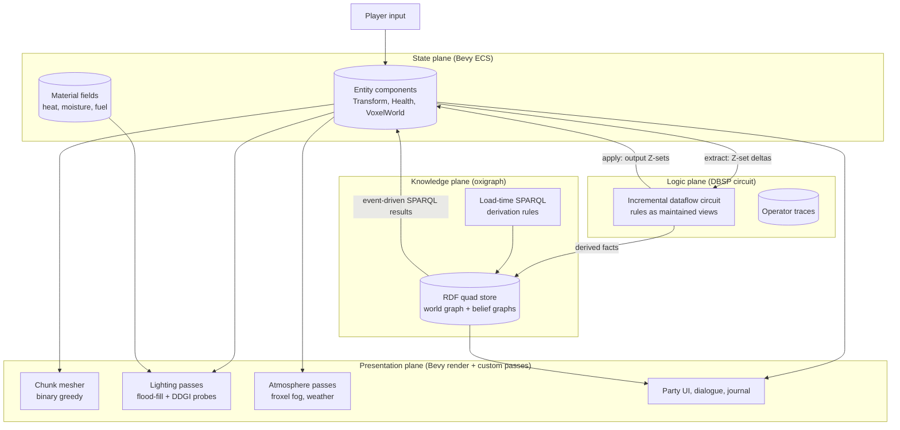
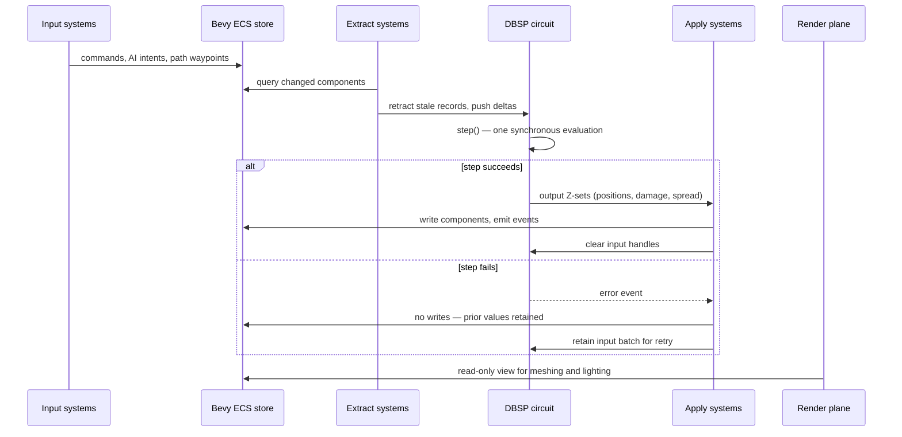
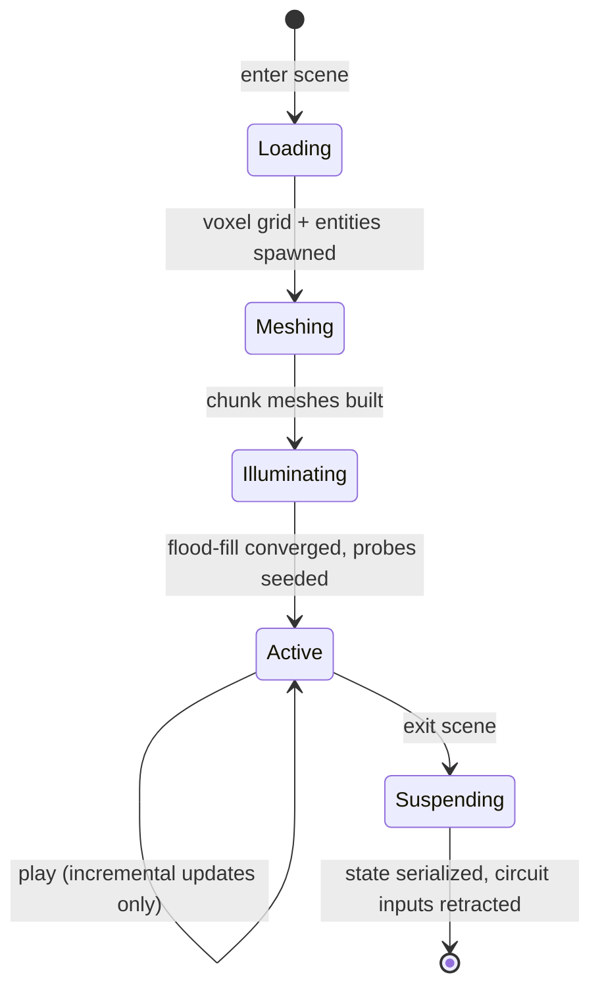
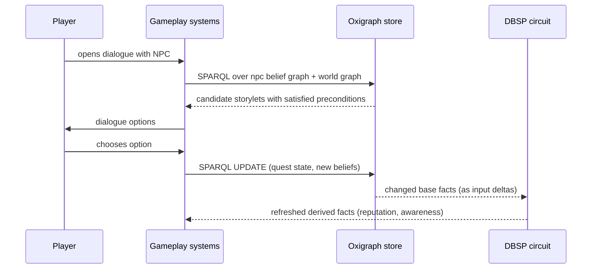

# Thysalion technical design

## Front matter

- **Status:** Draft for review.
- **Date:** 2026-07-22.
- **Audience:** developers implementing Thysalion's engine and content
  pipeline, and reviewers evaluating its architecture.
- **Companion documents:**
  [ADR 001](adr-001-meshed-voxel-rendering-pipeline.md) (meshed rendering
  pipeline), [ADR 002](adr-002-dbsp-as-logic-authority.md) (DBSP as logic
  authority), [ADR 003](adr-003-oxigraph-knowledge-plane.md) (oxigraph
  knowledge plane), and [ADR 004](adr-004-tiered-lighting-software-ddgi.md)
  (tiered lighting). The
  [documentation style guide](documentation-style-guide.md) governs
  conventions; the [repository layout](repository-layout.md) governs file
  placement.
- **Scope:** the runtime architecture of the game engine and its content
  formats. A development roadmap is a separate document and is out of scope
  here.

## 1. Design context and motivation

Thysalion is an isometric voxel role-playing game (RPG) in the lineage of
Ultima VII: a party of characters explores a dense, simulated world in which
NPCs hold schedules, knowledge, and opinions; objects are usable rather than
decorative; and systems (fire, weather, light, rumour) interact rather than
being scripted set-dressing. The reference concept art in `references/` defines
the visual target: chunky voxel construction with irregularity and bevels, warm
key lights against cool ambient fill, pools of illumination with strong value
structure, rich material variation, regional identity through light and colour,
and small-scale environmental storytelling.

Two observations drive the architecture:

1. **Simulation-first RPGs are constraint-propagation problems.** Most of
   what makes an Ultima VII scene feel alive is derived state: who can see
   what, what is on fire, which NPC has heard which rumour, what the light
   level is in a cellar at dusk. Deriving such state imperatively scatters
   invalidation logic across systems and breeds stale-cache bugs. Expressing it
   as incrementally maintained views over base facts centralizes derivation and
   makes cost proportional to change, not world size
   ([Budiu et al. 2023](https://www.vldb.org/pvldb/vol16/p1601-budiu.pdf)).
2. **A fixed isometric camera over bounded, authored scenes removes the
   hardest problems in voxel rendering.** Infinite streaming worlds dominate
   the voxel-engine ecosystem and impose meshing, level-of-detail (LOD), and
   memory regimes Thysalion does not need. Bounded dioramas permit load-time
   meshing, tightly budgeted lighting volumes, and aggressive fixed-view
   culling.

The prior project `lille` (a real-time strategy prototype by the same authors)
validated the core state/logic split — a Bevy Entity Component System (ECS)
synchronized with a DBSP dataflow circuit each frame — and its lessons, both
positive and negative, are incorporated throughout (§5.1).

## 2. Goals and non-goals

### 2.1. Goals

- **G1 — Simulated world.** NPC knowledge, quest state, material state
  (fire, water, wetness), and lighting respond to play without bespoke
  scripting per interaction. Verifiable outcome: the fire/rumour/light
  scenarios in §10 and §11 run on the generic rule machinery alone.
- **G2 — Deterministic simulation.** Identical inputs produce identical
  world states, enabling replay-based debugging and save integrity (invariant
  I1, §14).
- **G3 — The reference look on mid-range hardware.** The lighting model in
  §9 reproduces the concept art's warm-key/cool-fill structure, day/night
  cycle, weather, and emissive magic without requiring hardware ray tracing.
- **G4 — Designer-authorable content.** Scenes, voxel palettes, lore, NPC
  knowledge, and dialogue preconditions are plain-text, diffable formats (§7.3,
  §11.5) editable without recompiling the engine.
- **G5 — Bounded resource envelope.** Every subsystem carries an explicit
  state or time budget: simulation state growth (§10.6), probe counts and
  update budgets (§9.3), and per-scene voxel bounds (§7.1).

### 2.2. Non-goals

- **Infinite or procedurally streamed worlds.** Scenes are authored,
  bounded dioramas; the engine never generates terrain at runtime.
- **Multiplayer.** Determinism (G2) keeps lockstep viable later, but no
  networking is designed here.
- **Hardware ray tracing as a requirement.** An optional high-end path may
  exist (§9.7), but no baseline feature depends on ray-tracing hardware or
  vendor-specific denoisers.
- **General-purpose modding.** Authorable formats (G4) are for the project's
  own content pipeline; a public modding surface is not designed.
- **Ontological reasoning.** The knowledge plane stores and queries facts;
  it performs no RDFS/OWL entailment (§11.4).

### 2.3. Design intent summary

Thysalion separates the world into four planes with distinct change rates and
consistency needs: a **state plane** (Bevy ECS) holding current spatial and
component state; a **logic plane** (DBSP) deriving all rule-based consequences
incrementally and deterministically; a **knowledge plane** (oxigraph) holding
slow-changing meaning — lore, beliefs, quests — queried on events, never per
frame; and a **presentation plane** (Bevy render with custom compute passes)
that observes state and draws it, contributing no game logic. Bounded scenes
and a fixed camera make the expensive parts — meshing, global illumination,
culling — precomputable or cheaply incremental.

## 3. Glossary

Normative terms used throughout. Deviating uses are errors.

| Term                   | Definition                                                                                                                                      |
| ---------------------- | ----------------------------------------------------------------------------------------------------------------------------------------------- |
| Scene                  | One bounded, authored voxel diorama (for example a town, a keep interior, a swamp) with fixed dimensions, loaded and unloaded as a unit.        |
| Chunk                  | A fixed-size cubic subdivision of a scene's voxel grid; the unit of meshing and re-meshing.                                                     |
| Plane                  | One of the four architectural layers: state, logic, knowledge, presentation.                                                                    |
| Voxel type             | A palette entry defining a voxel's material class, per-face passability, slope, emission, and simulation properties (§7.2).                     |
| Material field         | A scalar field (heat, moisture, fuel, fluid level) co-located with the voxel grid and advanced by local stencil updates (§10.5).                |
| Z-set                  | DBSP's collection type: a multiset whose element weights may be negative; deltas are Z-sets with insertions weighted `+1` and retractions `-1`. |
| Retraction             | Removing a previously pushed record from a DBSP input by pushing it again with negative weight.                                                 |
| Circuit                | The single DBSP dataflow graph embodying all incremental game rules.                                                                            |
| Step                   | One synchronous evaluation of the circuit against its accumulated input deltas.                                                                 |
| Probe                  | A lighting sample point storing octahedral-encoded irradiance and depth moments (§9.3).                                                         |
| Flood-fill light field | The per-voxel two-channel (sun, block) 0–15 light values maintained by breadth-first propagation (§9.2).                                        |
| Belief graph           | A named RDF graph holding one NPC's (or faction's) knowledge, which may diverge from world truth (§11.2).                                       |
| Storylet               | A unit of dialogue or narrative content gated by a precondition query over the knowledge plane (§11.3).                                         |
| Quality                | A world or character fact used by storylet preconditions, stored as RDF triples.                                                                |
| Extract / apply        | The paired frame phases that push ECS changes into the circuit and write circuit outputs back to the ECS (§6.2).                                |

Acronyms: RPG (role-playing game), ECS (Entity Component System), NPC
(non-player character), GI (global illumination), DDGI (dynamic diffuse global
illumination), LOD (level of detail), SPARQL (SPARQL Protocol and RDF Query
Language), RDF (Resource Description Framework), IVM (incremental view
maintenance), AO (ambient occlusion), PBR (physically based rendering), DDA
(digital differential analyser), BVH (bounding volume hierarchy), WCOJ
(worst-case optimal join).

## 4. Personas and actors

- **Engine developer** — implements planes and passes; needs contracts
  between planes (§6, §12) and named invariants (§14).
- **Content designer** — authors scenes, palettes, lore, and storylets in
  the text formats of §7.3 and §11.5; needs the formats to be stable,
  documented, and validated at load.
- **Player** — controls a party through mouse/keyboard commands; expects a
  responsive world and honest saves.
- **System actors** — the continuous integration (CI) pipeline runs the
  verification suites of §14 headless; the save system serializes the three
  stores atomically (§12.3).

## 5. Prior art and technology selection

Each choice below records the alternatives considered and the reason for the
selection. Versions are as surveyed on 2026-07-22.

### 5.1. Lessons carried from lille

`lille` (dbsp 0.98, bevy 0.17.3) proved the extract → step → apply loop and
codified sharp edges Thysalion adopts as rules:

- The ECS is the sole state authority; the circuit is the sole logic
  authority. Bevy systems are thin, stateless data marshals.
- DBSP input Z-sets persist across steps: every frame must retract the
  prior snapshot before pushing the new one, and clear input handles after a
  successful apply (Thysalion tightens lille's unconditional clearing — see
  §6.2 rule 4). Retraction discipline is verified, not assumed (invariant I2,
  §14).
- The circuit is not `Send`; it lives in a non-send resource and
  constrains scheduling. Tests that touch it serialize.
- Stateful search does not belong in the circuit. A* pathfinding runs as
  imperative Rust; its waypoints are circuit inputs.
- Hot per-frame ingress bypasses Bevy's observer/event machinery: lille
  measured a direct-resource route at roughly 3.5× cheaper than an observer
  route at 10 000 events.
- A failed step must never half-write the ECS: apply systems bail before
  writing when the step errors.

### 5.2. Engine baseline: Bevy 0.19 on wgpu 29

[Bevy 0.19](https://bevy.org/news/bevy-0-19/) (June 2026) is the target. Its
GPU-driven rendering work (batched multi-draw indirect, GPU culling and
clustering) suits a diorama of many small static chunk meshes. Two consequences
shape this design:

- Bevy 0.19 replaced the render graph with ECS schedules; custom passes
  are ordinary systems in `Core3d`. All custom passes in §8 and §9 target this
  model, and pre-0.19 voxel rendering examples are treated as architecturally
  obsolete.
- An open performance regression
  ([bevy#24448](https://github.com/bevyengine/bevy/issues/24448)) from the
  render rewrite is tracked; the pinned minor version follows its resolution.

Bevy version churn was lille's dominant maintenance tax. Thysalion pins one
Bevy version per development phase and upgrades deliberately, never mid-feature.

### 5.3. Voxel layer: bevy_voxel_world as base

[bevy_voxel_world](https://github.com/splashdust/bevy_voxel_world) 0.17
(MIT/Apache-2.0) is the only surveyed voxel crate tracking Bevy 0.19. It
supplies chunk lifecycle, a persistent voxel-edit overlay, multithreaded
meshing scaffolding, voxel raycasting, and — decisively — delegate hooks for
custom meshing and custom materials. Thysalion uses those hooks and replaces
the crate's infinite-world assumptions (spawn distance, procedural terrain
callbacks) with bounded authored scenes meshed at load (§7.1, §8.1).

Alternatives rejected:

- [Wisphaven](https://github.com/jim-works/Wisphaven) — GPL-3.0; patterns
  readable, code unusable for a permissively licensed project.
- [bevy-voxel-engine](https://github.com/ria8651/bevy-voxel-engine) —
  unmaintained since early 2024, targets the removed render-graph API.
- [VoxelHex](https://github.com/Ministry-of-Voxel-Affairs/VoxelHex) — a
  sparse-voxel brick-tree raytracer on Bevy 0.17; retained as the documented
  research fallback should the meshed pipeline prove insufficient (ADR 001),
  not as the base.

### 5.4. Logic engine: DBSP

[dbsp](https://docs.rs/dbsp/latest/dbsp/) 0.323 (MIT/Apache-2.0, Feldera)
implements incremental view maintenance with a formally specified,
machine-checked semantics: any relational query becomes an incremental circuit
whose per-step cost tracks the size of the change, not of the database
([Budiu et al. 2023](https://www.vldb.org/pvldb/vol16/p1601-budiu.pdf)). Steps
are deterministic and transaction-ordered, which delivers G2 directly. A
published survey commissioned for this design found **no prior published use of
an IVM or differential-dataflow engine as a game's rules engine at interactive
tick rates** — the closest published result is a dataflow decomposition used
for engine parallelization
([Gajinov et al. 2014](https://doi.org/10.1109/SBAC-PAD.2014.21)). Two
adjacent bodies of evidence support the bet without settling it. Declarative
rule systems have driven playable games before — LUDOCORE modelled game rules
in the event calculus and supported "play as real-time, graphical games"
([Smith et al. 2010](https://doi.org/10.1109/ITW.2010.5593368)) — but without
incremental maintenance. And DBSP's per-step latency is documented at
millisecond scale in production: Feldera exposes a `dbsp_step_latency_seconds`
histogram and reports a customer pipeline of 217 join operators over 250
million rows sustaining roughly 200 ms incremental updates on one machine
([Feldera](https://www.feldera.com/overview)) — far heavier than any game
tick's workload, though not a game benchmark. The design therefore treats
DBSP-as-rules-engine as its principal novel risk and bounds it: the circuit's
scope is limited to the rule classes it demonstrably fits (§10.2), with
imperative escape hatches recorded per rule class (§10.3). Archetype-ECS
scheduling semantics are informal enough that published work warns against
resting determinism claims on them
([Tasnim & Zhao 2026](https://doi.org/10.1145/3748522.3779910)); placing
determinism authority in the circuit rather than in ECS system order is a
deliberate consequence.

### 5.5. Knowledge store: oxigraph

[oxigraph](https://docs.rs/oxigraph/latest/oxigraph/) 0.5.9 (MIT/Apache-2.0) is
an embeddable RDF quad store with SPARQL 1.1 query and update, repeatable-read
transactions, and Turtle/TriG serialization. Named graphs give per-NPC belief
sets natively (§11.2); TriG gives designers a diffable authoring format (G4).
Known caveats are accepted and mitigated: the project is pre-1.0 with
effectively one maintainer and unoptimized SPARQL join evaluation, so the store
is queried on events only, never per frame, with single-pattern lookups using
the direct index API (`quads_for_pattern`) rather than the SPARQL engine
(§11.6). Oxigraph performs no inference (§11.4); derivation is explicit.

Alternatives rejected: bespoke fact tables in the ECS (loses standard query,
serialization, and named-graph semantics); Datalog stores such as `ascent`/
`crepe` as the primary store (no standard persistence or authoring format —
Datalog-style derivation instead lives in the DBSP circuit, where it is
incremental).

### 5.6. Material simulation reference: evoxels

[evoxels](https://github.com/daubners/evoxels) (Python, MIT, JOSS
[10.21105/joss.09733](https://doi.org/10.21105/joss.09733)) demonstrates the
architecture Thysalion adopts for material simulation: dynamic material state
as scalar fields co-located on the voxel grid, advanced by local
finite-difference stencil updates, executed on the GPU. The concepts transfer;
the code (differentiable PyTorch/JAX solvers for offline science) does not.
Thysalion implements the cheap real-time end of this spectrum:
integer/cellular-automata stencils in compute shaders for cosmetic fields, and
discrete spread rules in the circuit for gameplay-visible state (§10.5).

### 5.7. Lighting: software-ray-marched DDGI over a flood-fill base

The lighting stack (§9) composes three published techniques rather than
inventing one: analytic direct lighting from Bevy's clustered forward renderer;
a Minecraft-style two-channel flood-fill light field (as implemented in, for
example, [Legend of Virelia](https://github.com/AhmadEleiwa/LegendOfVirelia)
and described by [Margel](https://adrianmargel.ca/projects/voxelLighting/));
and a DDGI-style irradiance probe grid
([Majercik et al. 2019](https://jcgt.org/published/0008/02/01/)) whose probe
rays are traced in software by marching the voxel grid in a compute shader.
Software probe tracing has published precedent — sparse-voxel-octree probe
marching ([Wang et al. 2019](https://doi.org/10.1145/3306131.3317024)) and
signed-distance-field DDGI
([Hu et al. 2020](https://arxiv.org/abs/2007.14394)) — and Bevy's own
experimental Solari GI stabilizes its indirect light with a world-space
irradiance cache that voxelizes the scene, independently validating the
voxel-grid-as-acceleration-structure premise. Voxel cone tracing, the
best-documented shipped alternative for fully voxelized games
([McLaren & Yang 2015](https://doi.org/10.1145/2775280.2792546)), was rejected
for its full-volume cost profile and weaker leak control relative to
visibility-weighted probes in bounded dioramas (ADR 004).
[bevy_solari](https://bevy.org/news/bevy-0-17/) requires ray-tracing hardware
and an Nvidia-only denoiser and is therefore outside the baseline (non-goal),
retained only as a possible ultra tier (§9.7).

## 6. Architectural summary

### 6.1. The four planes

For screen readers: the following diagram shows the four planes — presentation,
state, logic, and knowledge — with the data flows between them: input into the
ECS, extract/apply between ECS and circuit, derived facts from circuit to
store, event-driven query results from store to ECS, and read-only flows from
ECS and material fields into the render passes.



_Figure 1: the four planes and the data flows between them. Solid arrows are
per-frame flows; flows touching the knowledge plane are event-driven._

Each plane has one authority relationship:

| Plane                | Authoritative for                                                            | Never does                                 |
| -------------------- | ---------------------------------------------------------------------------- | ------------------------------------------ |
| State (ECS)          | Current component values, voxel grid, material fields                        | Derive rule consequences                   |
| Logic (DBSP)         | All derived state: motion resolution, damage, spread, visibility, aggregates | Hold render or asset state; perform search |
| Knowledge (oxigraph) | Lore, beliefs, quests, dialogue facts                                        | Participate in the frame loop              |
| Presentation         | Meshes, lighting textures, UI                                                | Mutate game state                          |

The planes map onto Cargo workspace crates —
[ADR 005](adr-005-workspace-crate-layout.md) records the crate-per-plane
layout, the plane-to-crate name table, the layering rules that keep the cyclic
data flow above acyclic at the crate level, and the demo harness contract
shared by every capability demonstration.

### 6.2. Frame anatomy

The simulation runs on a fixed tick (30 Hz) decoupled from the render rate;
render frames interpolate transforms between the last two ticks. Each tick
executes one strict sequence.

For screen readers: the following sequence diagram shows one simulation tick:
input systems write to the ECS; extract systems retract stale records and push
deltas into the circuit; the circuit steps once; on success apply systems write
outputs back to the ECS, on failure nothing is written; input handles are
cleared; render systems read the ECS afterwards.



_Figure 2: one simulation tick. The extract and apply systems are chained; no
other system touches the circuit._

Ordering rules, all inherited from lille and enforced by Bevy system sets:

1. Extract systems use `Added`/`Changed`/`RemovedComponents` queries to
   compute minimal deltas; they never rescan the world.
2. Exactly one `step()` per tick. The tick counter lives inside the
   circuit as a source operator, keeping time authority in the dataflow.
3. Apply systems write only records the circuit emitted; a failed step
   writes nothing (the error surfaces as a diagnostic event) so the ECS never
   holds a half-applied tick.
4. Input handles are cleared only after a successful step. A failed
   step's batch is retained: the extract systems' `Added`/`Changed`/
   `RemovedComponents` filters have already consumed those change events and
   will not re-emit them, so dropping the batch would leave the circuit
   permanently stale. Because deltas are Z-sets, the retained batch composes
   additively with the next tick's deltas, and the retry step evaluates both
   together.
5. Knowledge-plane traffic (SPARQL queries and updates) runs outside the
   tick sequence, on events, from dedicated systems (§11.6).

### 6.3. Scene lifecycle

For screen readers: the following state diagram shows a scene moving from
Loading through Meshing and Illuminating to Active, looping in Active during
play, and leaving through Suspending back to the terminal state.



_Figure 3: scene lifecycle. All whole-scene costs (meshing, light-field
convergence, probe seeding) are paid before Active; during Active every
subsystem operates incrementally._

The lifecycle is the load-bearing performance contract: entering Active asserts
that meshing is complete, the flood-fill field has reached its fixpoint, and
every probe holds a seeded estimate. During Active, voxel edits re-mesh only
affected chunks (§8.1), light updates propagate only from changed voxels
(§9.2), probes refresh round-robin (§9.3), and the circuit processes only
deltas. Suspending retracts every scene-scoped record from the circuit so
operator traces consolidate (§10.6) and serializes state per §12.3.

## 7. Voxel world model

### 7.1. Scenes and chunks

A scene is a bounded grid of voxels with fixed dimensions declared in its
manifest, subdivided into cubic chunks of 32³ voxels. Representative scene
budgets, derived from the reference art's scale (characters three to four heads
tall, one voxel roughly 10 cm):

| Scene class   | Typical extent (voxels) | Chunks | Notes                           |
| ------------- | ----------------------- | ------ | ------------------------------- |
| Interior      | 128 × 128 × 64          | 32     | keep interiors, cellars         |
| Town district | 512 × 512 × 96          | 768    | the market-town reference scene |
| Wilderness    | 1024 × 1024 × 128       | 4096   | swamp, mountain pass            |

_Table 1: scene size classes and chunk counts._

Chunks exist for meshing granularity and edit locality, not streaming: a
scene's chunks all reside in memory while the scene is loaded. The voxel grid
itself is the state plane's data; `bevy_voxel_world` supplies the chunk map and
edit overlay, with its procedural-generation delegate returning the authored
scene content instead of noise-derived terrain.

### 7.2. Voxel types

Every voxel stores a 16-bit index into the scene's palette of voxel types. A
voxel type is the unit of material meaning, carrying rendering, pathfinding,
and simulation properties together:

```rust,no_run
/// One palette entry: everything the engine knows about a voxel kind.
pub struct VoxelType {
    pub name: SmolStr,
    /// Material class selects texture set and PBR parameters.
    pub material: MaterialClass,
    /// Per-face passability for pathfinding, indexed by face normal.
    pub passable: [bool; 6],
    /// Direction of rise for ramps and stairs; zero when flat.
    pub slope_dir: IVec2,
    /// Emitted light: intensity 0–15 and colour, zero when inert.
    pub emission: LightEmission,
    /// Simulation coefficients for the material fields (§10.5).
    pub sim: SimProperties, // fuel, ignition point, moisture capacity…
    /// Knowledge-plane identity for this voxel kind, when it has one.
    pub concept: Option<IriRef>, // e.g. thy:OakDoor
}
```

The per-face passability and slope encoding follow lille's map format, where
they proved sufficient for 3-D pathfinding over ramps and ledges. The `concept`
field is the bridge to the knowledge plane: a voxel type may name the ontology
concept it instantiates, so that rules such as "guards notice broken doors"
ground out in voxel-level facts (§11.2).

### 7.3. Scene format

Scenes are single logical documents with three encodings — JSON for authoring
and diffing, MessagePack for shipping, one structure for both — following
lille's proven format, extended with lighting and knowledge fields:

- `dimensions`, `chunk_size` — grid bounds.
- `palette` — the ordered list of voxel types (§7.2).
- `voxels` — palettized dense Z-major layers, run-length encoded.
- `entities` — spawn list; entity definitions support prototype
  inheritance (`extends` plus overrides), so an `archer` extends `guard` extends
  `humanoid`.
- `lighting` — sun path parameters, ambient palette per time-of-day band
  (matching the concept art's seven biome palettes), probe-volume bounds and
  spacing overrides (§9.3).
- `knowledge` — the scene's TriG files to load into the knowledge plane,
  and the IRI of the scene's own named graph (§11.5).

Validation happens entirely at load: unknown palette references, out-of-bounds
spawns, or dangling knowledge IRIs fail the load with a diagnostic, never a
partially loaded scene.

### 7.4. Authoring pipeline

Scenes are authored in a Tiled-based workflow (layered isometric editing, as
built for lille) plus direct in-engine voxel editing for detail passes; both
emit the JSON encoding. MagicaVoxel `.vox` import is supported for props and
set-dressing brought in as palette-mapped voxel stamps. The authoring pipeline
is content tooling, not runtime: the engine consumes only the scene format.

## 8. Rendering plane

### 8.1. Meshing

Chunks are meshed on the CPU task pool at scene load, using a binary greedy
mesher (the
[binary-greedy-meshing](https://crates.io/crates/binary-greedy-meshing) family)
plugged into `bevy_voxel_world`'s custom-meshing delegate. Greedy merging
collapses coplanar same-material faces into large quads, so per-voxel variation
(ambient occlusion, tint, weathering) travels in vertex attributes and texture
indices rather than geometry. A voxel edit re-meshes only its chunk (and
face-adjacent chunks when the edit touches a boundary), asynchronously, with
the stale mesh drawn until the replacement arrives — an artefact accepted as
invisible at the fixed camera's scale.

The many-small-static-meshes workload lands directly on Bevy 0.19's batched
multi-draw-indirect path; no bespoke draw batching is designed.

### 8.2. Fixed-camera techniques

The camera is orthographic-isometric with four allowed yaw quadrants and a
bounded zoom range. Two classic techniques exploit this:

- **Octant culling.** With at most four view quadrants, chunk faces
  pointing away from the active quadrant are never meshed into the visible set;
  quadrant changes swap precomputed face sets rather than re-meshing.
- **Cut-away interiors.** Ultima VII's roof-removal is implemented as a
  clip-height uniform on the voxel material: voxels above the party's current
  storey, within occluding structures, are discarded in the fragment stage with
  a dithered edge band. Structure membership (which voxels form the building
  the party is inside) is a derived relation maintained by the circuit (§10.2),
  not a per-frame spatial query.

### 8.3. Custom passes under Bevy 0.19

All custom GPU work — the flood-fill upload, probe update dispatches, fog
froxel pass — is written as systems in the `Core3d` schedule against Bevy
0.19's render-systems model. Each pass is a plugin with an explicit ordering
constraint relative to the standard PBR passes, and each degrades independently
(§13): a failed pipeline compilation disables its pass and logs, rather than
aborting the frame.

## 9. Lighting and atmosphere

The lighting model is tiered. Every tier is additive over the one below it, and
every tier runs on plain rasterization and compute — no ray-tracing hardware
(non-goal, §2.2).

| Tier | Mechanism                                             | Provides                                                                                  | Cost profile                             |
| ---- | ----------------------------------------------------- | ----------------------------------------------------------------------------------------- | ---------------------------------------- |
| 0    | Bevy clustered forward PBR + shadow maps              | Sun/moon direct light, torch/lantern/fire point lights, emissive voxels                   | Engine baseline                          |
| 1    | Flood-fill light field (compute)                      | Instant light response, day/night attenuation, sky-visibility mask, gameplay light levels | Microseconds per edit, converged at load |
| 2    | DDGI-style probe grid, software-ray-marched (compute) | Diffuse interreflection, colour bleed, leak-free interior bounce                          | Amortized round-robin budget             |

_Table 2: lighting tiers. Tier 0 and tier 1 are mandatory; tier 2 is the
default on mid-range discrete GPUs and disabled on the low-spec preset._

### 9.1. Tier 0 — direct lighting

Bevy's clustered forward renderer handles analytic lights natively. Scene
lights come from emissive voxel types (torch sconces, hearths) registered as
point lights at mesh time, plus the sun/moon directional light animated along
the scene's authored sun path. Shadow-casting light count per scene class is
budgeted in the scene manifest (interiors: 8; districts: 16). Magic effects are
emissive meshes with bloom; wet surfaces modulate specular per §9.5.

### 9.2. Tier 1 — flood-fill light field

A two-channel 0–15 light value per voxel — sky light and block light —
maintained by breadth-first flood-fill exactly as in the Minecraft lineage. Sky
light injects at sky-visible columns and attenuates per opaque voxel; block
light injects at emissive voxels. Day/night scales the sky channel by the
sun-path factor before composition, and the shading composite takes
`max(sky × day_factor, block)`.

The field serves four consumers: a broad ambient term in the voxel material
(tier 1's visual contribution); the gameplay light level exposed to the circuit
(stealth, NPC perception — §10.2); the sky-visibility mask driving wetness
(§9.5); and seeding for probe rays (tier 2 falls back to the field where probes
are unconverged). Updates are incremental (re-propagation from changed voxels
only) and run in compute over the scene's voxel texture; convergence at load is
part of the Illuminating lifecycle state (Figure 3), and incremental
convergence is invariant I4 (§14).

### 9.3. Tier 2 — probe-grid diffuse GI

A regular grid of irradiance probes covers each scene at 2 m default spacing
(denser volumes may be authored over interiors). Following
[Majercik et al. 2019](https://jcgt.org/published/0008/02/01/), each probe
stores octahedral-encoded irradiance plus mean and mean-squared ray distance;
shading interpolates the eight surrounding probes weighted by trilinear
position, surface-normal cosine, and a Chebyshev visibility test against the
depth moments — the mechanism that prevents light leaking through walls.
Temporal hysteresis blends new probe estimates over old.

The departure from the published pipeline is ray generation: probe rays are
traced by a DDA march through the scene's voxel grid in a compute shader,
sampling voxel albedo and the tier 0/1 lighting at the hit. The voxel grid is
already resident on the GPU for tier 1, so no BVH or hardware ray tracing is
required; published SVO-probe-marching
([Wang et al. 2019](https://doi.org/10.1145/3306131.3317024)) and SDF-DDGI
([Hu et al. 2020](https://arxiv.org/abs/2007.14394)) establish the pattern.
Production hardening follows
[Majercik et al. 2020](https://arxiv.org/abs/2009.10796): the self-shadow bias
term, a probe state machine (probes classified off/asleep/awake so buried or
unreachable probes cost nothing), and per-scene probe volumes rather than one
world volume. If the update budget is exceeded on target hardware,
importance-based ray allocation
([Liu et al. 2023](https://doi.org/10.1145/3585500)) is the named mitigation,
reported to cut probe-ray cost by 3.3–6.6× at equal quality.

The fixed camera and bounded scenes keep the numbers small: a full 512 × 512 ×
96-voxel district at 2 m spacing is roughly 26 × 26 × 5 ≈ 3 400 probes; an
interior is a few hundred. Probes update round-robin under a fixed per-frame
dispatch budget, biased towards probes near dynamic lights and recent voxel
edits.

Published figures ground the budget. The reference DDGI configuration — 8 192
probes (32 × 8 × 32) at 64 rays per probe, 8 × 8 irradiance and 16 × 16 depth
texels — costs 2.6 ms of diffuse GI per frame on an RTX 2080 Ti at 1080p
([Majercik et al. 2019](https://jcgt.org/published/0008/02/01/), Table 2).
Software ray generation does not break this: SDF-DDGI reports 1.67 ms total on
the same GPU and under 5 ms on a laptop-class GTX 970M with a sphere-traced
software pipeline ([Hu et al. 2020](https://arxiv.org/abs/2007.14394)), and
non-uniform probe tracing against a sparse voxel octree ran 30–53% faster than
its hardware-free predecessor on a GTX 1060
([Wang et al. 2019](https://doi.org/10.1145/3306131.3317024)). Probe sleeping
alone saves 28–54% of update cost in production scenes
([Majercik et al. 2020](https://arxiv.org/abs/2009.10796)). Thysalion's worst
case carries roughly 0.4× the reference probe count with a cheaper per-ray
primitive (grid DDA against a resident 3-D texture), so a 2 ms tier 2 budget on
mid-range hardware is conservative; the hysteresis default follows the
published range (α ≈ 0.95). The budget's reference baseline is a GeForce RTX
3060 (12 GB) on NVIDIA driver 591.59 (R590 production branch) at 1920 × 1080 on
the default preset, reporting 95th-percentile per-frame tier 2 GPU time over a
10-second measurement window after a 5-second warm-up. Benchmark output records
the driver actually in use, so any drift from the pinned baseline is visible in
the measurements.

An illustrative WGSL kernel sketch for the probe-ray DDA march:

```wgsl
// Illustrative sketch — one probe ray. The voxel grid is a 3-D texture of
// palette indices; palettes resolve to albedo + emission in a uniform
// array. Returns radiance carried back to the probe integration step.
fn march_probe_ray(origin: vec3<f32>, dir: vec3<f32>) -> vec3<f32> {
    var t = dda_init(origin, dir);
    for (var i = 0u; i < MAX_STEPS; i = i + 1u) {
        let cell = dda_next(&t);
        if (out_of_bounds(cell)) {
            return sky_radiance(dir);           // escaped: sky term
        }
        let vox = palette_of(cell);
        if (vox.opaque) {
            let n = dda_hit_normal(&t);
            let direct = sample_direct_light(cell, n);   // tier 0
            let ambient = floodfill_ambient(cell);       // tier 1
            return vox.albedo * (direct + ambient) + vox.emission;
        }
    }
    return sky_radiance(dir);
}
```

### 9.4. Atmosphere

- **Volumetric fog and light shafts:** Bevy's built-in froxel
  `VolumetricFog` provides height fog, fog volumes for the swamp and harbour
  scenes, and god rays from the sun and strong point lights. A screen-space
  radial-blur pass is the documented low-spec fallback.
- **Weather particles:** rain and snow are GPU particle systems clipped
  against the sky-visibility mask from tier 1, so covered areas stay dry.
- **Time-of-day:** the sun path drives the directional light, the sky
  channel scale, ambient palette interpolation across the scene's authored
  time-of-day bands, and fog albedo — reproducing the concept art's distinct
  dawn/afternoon/blue-hour/night moods from one parameter.

### 9.5. Wetness and material response

Rain raises a per-voxel wetness value on sky-visible surfaces (mask from tier
1); wetness darkens albedo and lowers roughness in the voxel material,
producing the reference art's wet-cobblestone specular. Wetness decays over
game time and feeds the moisture material field (§10.5), so rain measurably
retards fire spread — a deliberate systems-interaction showcase (G1).

### 9.6. Combination surface

Lighting tiers × platform presets × weather states multiply into a combination
space that does not verify itself. The design commits to the following
coverage: the three presets (low: tiers 0–1; default: tiers 0–2; ultra: §9.7)
each run the §14 lighting invariants headless in CI under clear, rain, and
night conditions — nine combinations per scene fixture. Visual parity across
presets is explicitly not asserted (presets look different by design); the
invariants assert convergence, leak bounds, and absence of NaN/negative
radiance.

### 9.7. Ultra tier (deferred)

`bevy_solari` composes with the meshed pipeline and could replace tier 2 on
ray-tracing hardware. It remains experimental, diffuse-only, and tied to a
vendor denoiser; the decision is deferred until it stabilizes, and no baseline
feature may depend on it (§15).

## 10. Simulation plane

### 10.1. Circuit shape and integration

One `DbspCircuit` wrapper owns the DBSP root circuit, its typed input handles,
and its output handles, built once at startup. The Bevy side follows the lille
plumbing exactly: a non-send resource holds the circuit; an incremental
entity-identity map (`SimId` component ↔ circuit key) tracks membership;
extract and apply systems are chained; the tick counter is a source operator
inside the circuit. Entities without a `SimId` never enter the simulation — UI,
particles, and camera stay ECS-only by construction.

### 10.2. Rules expressed as maintained views

The circuit's rule classes, each a small dataflow of joins, aggregates, and
arithmetic maps over input relations:

| Rule class            | Inputs                                                       | Outputs                                   | Shape                                                                    |
| --------------------- | ------------------------------------------------------------ | ----------------------------------------- | ------------------------------------------------------------------------ |
| Support and motion    | positions, velocities, voxel passability                     | resolved positions                        | join with floor-height aggregate, branch standing/unsupported, recombine |
| Combat resolution     | attack events, stats, health                                 | health deltas, death edges                | fold with saturating bounds, edge detection                              |
| Perception            | positions, facing, light level (tier 1), occlusion summaries | who-sees-whom relation                    | join + filter against thresholds                                         |
| Structure membership  | voxel adjacency, door/wall types                             | building interiors, party-inside relation | fixpoint (recursive) connected components                                |
| Discrete spread       | ignition events, material fields snapshot, voxel adjacency   | newly ignited/extinguished voxels         | fixpoint over adjacency, bounded per tick                                |
| Reactive social facts | witness events, faction membership                           | crime awareness, aggregate reputation     | join + aggregate, exported to knowledge plane                            |

_Table 3: circuit rule classes. Fixpoint classes use nested circuits
(semi-naive evaluation); all others are non-recursive._

An illustrative sketch of the perception view's construction:

```rust,no_run
/// Perception: an observer sees a target when within range, facing it,
/// and the target's voxel is lit above the observer's threshold.
fn perception_stream(
    positions: &Stream<C, OrdZSet<Position>>,
    light: &Stream<C, OrdZSet<VoxelLight>>,
    senses: &Stream<C, OrdZSet<Senses>>,
) -> Stream<C, OrdZSet<Sees>> {
    let located = positions.map_index(|p| (p.voxel(), p.clone()));
    let lit = light.map_index(|l| (l.voxel, l.level));
    located
        .join(&lit, |_, p, level| (p.entity, (p.clone(), *level)))
        .join(&senses.map_index(|s| (s.entity, s.clone())), sees_pair)
        .filter(|s| s.in_range && s.in_arc && s.lit_enough)
}
```

### 10.3. What stays out of the circuit

Boundaries recorded as rules, with the escape hatch named per class:

- **Search** (A* pathfinding, flow fields): imperative Rust over the
  passability data; waypoints are circuit inputs.
- **Order statistics** (nearest visible enemy, weakest target): a spatial
  index (grid hash) queried by imperative systems; results enter as intent
  records. DBSP handles min/max poorly over frequently retracted groups.
- **Continuous fields** (§10.5): compute shaders, not Z-sets.
- **Large one-shot transformations** (scene load, mass despawn): staged
  across ticks by the loader so no single step's delta spikes past the tick
  budget — the incremental analogue of bounded view-maintenance steps
  ([Salem et al. 2000](https://doi.org/10.1145/342009.335393)).

### 10.4. Tick and time

The simulation tick is 30 Hz; one game minute is 6 real seconds by default,
giving day/night cycles that match the reference art's mood range without
racing the player. All rule constants (cooldowns, spread rates) are expressed
in ticks and live in one registry so the tick rate can be retuned during
development without semantic drift.

### 10.5. Material fields

Continuous material state — heat, moisture, fuel, fluid level — lives in GPU
scalar fields over the voxel grid, advanced by local stencil kernels in compute
(the evoxels pattern, real-time grade). The split with the circuit's
discrete-spread class is by observability:

- **Fields (GPU, cosmetic-continuous):** heat shimmer, drying puddles,
  smoke density. Read back only at coarse granularity for effects.
- **Circuit (CPU, gameplay-discrete):** a voxel _ignites_, a beam
  _collapses_, a field _floods_. Discrete transitions are circuit facts —
  deterministic (G2), save-stable, and visible to perception and knowledge
  rules.

The coupling contract: field kernels raise discrete _threshold-crossing events_
(heat above ignition point at voxel v) which enter the circuit as inputs;
circuit decisions (voxel v now burning) flow back as field boundary conditions.

Because threshold crossings feed authoritative circuit state, field values near
a threshold cannot tolerate lossy persistence: a quantized heat value restored
one unit low would fire an ignition on a different tick and diverge the circuit
and knowledge planes. Fields therefore use integer fixed-point representations
(16 bits per channel) as their runtime format, updated by order-independent
stencil kernels — no atomics, no scheduling-dependent accumulation — so field
evolution is deterministic and a snapshot of the fixed-point values is
bit-exact by construction. Threshold comparisons execute on the same
fixed-point values the snapshot stores, so a restored session reproduces every
pending crossing on the same tick (I3, §14). Saves persist the circuit-side
discrete state plus the exact field planes (§12.3).

### 10.6. State-growth budget

DBSP joins retain both sides indefinitely; unbounded inputs mean unbounded
traces. Three rules bound growth (G5):

1. Every scene-scoped record is retracted at scene exit (Figure 3), so
   traces consolidate to the persistent party/world core.
2. Event relations (attacks, witness events) carry a tick horizon:
   derived rules never join events older than their class's horizon, and an
   in-circuit retraction (delayed negative weight, the lille cooldown pattern)
   expires them.
3. A diagnostic overlay reports per-operator trace sizes each session;
   the CI soak test (§14, I7) fails on monotonic growth across scene cycles.

## 11. Knowledge plane

### 11.1. Store configuration

One in-memory oxigraph `Store` holds all knowledge-plane state. The on-disk
RocksDB backend is not used: game-scale data (tens of thousands to low hundreds
of thousands of quads) loads from TriG in negligible time, and saves serialize
back to TriG (§12.3), keeping save files platform-portable and diffable. The
`rdf-12` feature is enabled for RDF-star statement annotation.

### 11.2. Graph layout

| Graph                               | Contents                                                                                                   | Written by                                     |
| ----------------------------------- | ---------------------------------------------------------------------------------------------------------- | ---------------------------------------------- |
| `thy:ontology`                      | The static concept taxonomy: item, creature, and structure classes; faction definitions; storylet metadata | Content pipeline only                          |
| `world:graph`                       | Ground truth: places, NPC identities and roles, quest states, world-scale flags                            | Quest updates, circuit exports                 |
| One belief graph per NPC or faction | What that agent believes — a subset of, or divergence from, ground truth, annotated with provenance        | Gossip propagation, witnessed events, dialogue |
| `scene:<id>`                        | Scene-local facts loaded with the scene manifest                                                           | Content pipeline, scene lifecycle              |

_Table 4: named-graph layout of the knowledge store._

Belief divergence is the Ultima-VII mechanic this layout exists for: NPCs know
different, possibly wrong, things. RDF-star annotates individual belief
statements with provenance and game-time
(`<< npc:bob thy:knows quest:heist >> thy:heardFrom npc:alaina`), so gossip
chains, lies, and stale information are first-class.

The sample below is the validated authoring-format artefact (TriG):

```trig
@prefix thy: <https://thysalion.df12.net/ontology#> .
@prefix world: <https://thysalion.df12.net/world#> .
@prefix npc: <https://thysalion.df12.net/npc#> .
@prefix quest: <https://thysalion.df12.net/quest#> .

# Ground truth: the world graph.
world:graph {
    world:lakeshire a thy:Town ;
        thy:region world:heartlands .

    npc:alaina a thy:Baker ;
        thy:residesIn world:lakeshire ;
        thy:memberOf world:bakersGuild .

    quest:spice-run a thy:Quest ;
        thy:stage quest:spice-run-not-started ;
        thy:questGiver npc:aeric .
}

# What Alaina believes — may diverge from truth.
npc:alaina-beliefs {
    npc:roderick thy:reputedTo thy:Honest .
    world:northRoad thy:hasCondition thy:Dangerous .
}
```

### 11.3. Storylets and dialogue

Dialogue and narrative content are storylets: content units whose preconditions
are SPARQL `ASK`/`SELECT` queries over the union of the world graph, the
speaking NPC's belief graph, and the ontology — the quality-based narrative
model ([Short](https://emshort.blog/category/quality-based-narrative/)) with
SPARQL as the quality store. Opening dialogue runs the candidate storylets'
precondition queries once, caches the result set for the conversation, and
offers the satisfied options; choosing one executes its effect: a SPARQL
`UPDATE` (quest stage advance, new beliefs) inside one transaction. Salience
ranking (most-specific-match) orders competing storylets by precondition
specificity, with authored priority as tiebreak.

### 11.4. Derivation without a reasoner

Oxigraph performs no RDFS/OWL entailment. Derived knowledge comes from two
explicit mechanisms:

- **Load-time closure:** a bounded, ordered list of SPARQL
  `INSERT … WHERE` rules (for example, materializing subclass closure over the
  small static taxonomy) runs to fixpoint at content load. The rule list is
  content, versioned with the ontology.
- **Runtime reactive facts:** anything that must stay current as play
  proceeds — crime awareness per district, aggregate faction reputation — is a
  circuit view (Table 3) whose output the apply phase writes into the world
  graph as plain triples. The store never computes joins on the hot path; the
  circuit does, incrementally.

### 11.5. Authoring

Designers author the ontology, initial world graph, per-NPC starting beliefs,
and storylets as TriG files referenced from scene manifests (§7.3). Storylet
text bodies live alongside as structured text with the precondition query
embedded. Load validates every file: parse errors, IRIs outside the project
namespaces, and storylet preconditions that fail to parse reject the content at
load with a diagnostic.

### 11.6. Query discipline

Knowledge-plane access runs only on events — dialogue open, scene enter, quest
trigger, journal open, save — from dedicated systems outside the tick sequence
(Figure 2), with results cached on components. Single- pattern lookups use
`quads_for_pattern` directly. A debug assertion fails any system that issues a
SPARQL query from within the tick schedule.

For screen readers: the following sequence diagram shows the dialogue flow: the
player opens dialogue; gameplay systems query the oxigraph store across belief
and world graphs; satisfied storylets return; the player chooses an option; the
store is updated transactionally; changed facts flow to the DBSP circuit as
input deltas, and refreshed derived facts return to gameplay systems.



_Figure 4: event-driven knowledge flow during dialogue. No knowledge query runs
inside the simulation tick._

## 12. Data flow and consistency

### 12.1. Ownership matrix

Exactly one store is authoritative for any datum; the others hold derived
copies that may lag within stated bounds:

| Datum                                                  | Authority          | Derived copies                     | Lag bound                       |
| ------------------------------------------------------ | ------------------ | ---------------------------------- | ------------------------------- |
| Entity transforms, health values                       | ECS                | circuit inputs                     | one tick                        |
| Rule consequences (motion, damage, spread, perception) | circuit            | ECS components                     | same tick (apply phase)         |
| Voxel grid, palette                                    | ECS (scene asset)  | GPU textures, circuit passability  | one tick                        |
| Material fields                                        | GPU fields         | circuit threshold events           | one tick                        |
| Lore, beliefs, quest stage                             | oxigraph           | cached query results on components | until the next triggering event |
| Reactive social aggregates                             | circuit            | world graph triples                | one tick                        |
| Light field, probes                                    | GPU lighting state | gameplay light level in circuit    | one tick                        |

_Table 5: ownership matrix across the three stores and the GPU._

### 12.2. Identity across planes

A single stable 64-bit `SimId` keys an entity everywhere: as the ECS component,
the circuit record key, and the IRI suffix in the knowledge plane (`npc:alaina`
owns `SimId(0x…)` via one bidirectional map loaded with the scene). Referential
integrity across the three stores is invariant I6 (§14).

### 12.3. Saving and loading

A save is one atomic archive containing:

1. the ECS snapshot: components of all `SimId` entities plus scene
   identity and clock;
2. the knowledge plane: TriG serialization of all graphs except the
   static ontology;
3. material-field snapshots, bit-exact in their fixed-point runtime
   format (§10.5);
4. the transient event ledger: horizon-limited event records and pending
   in-circuit retractions (cooldowns, expiries) with their remaining ticks;
5. the save-format version and content hashes of every immutable input in
   use: scene assets, the static ontology graph, the storylet definitions, and
   the load-time derivation rule list. Load refuses any mismatch.

The circuit is not serialized. On load, the engine rebuilds the circuit from
scratch and replays the extract phase from the restored ECS and knowledge
state. Persistent circuit relations derive from the restored stores; transient
relations — the §10.6 horizon-limited events and cooldown state — are restored
by replaying the saved event ledger into the circuit's inputs with their
remaining horizons. This serializes the engine's own record types, preserving
independence from DBSP's checkpoint format. This trades load-time recomputation
(bounded: one scene's worth of extraction and one convergence step) for
complete independence from DBSP's internal checkpoint format. Save correctness
is invariant I3 (§14).

## 13. Failure modes and degradation

Each plane degrades independently; no single-subsystem failure aborts the
session.

| Failure                                                          | Detection                                                                                  | Response                                                                                                                                                                                                                                                                            |
| ---------------------------------------------------------------- | ------------------------------------------------------------------------------------------ | ----------------------------------------------------------------------------------------------------------------------------------------------------------------------------------------------------------------------------------------------------------------------------------- |
| Circuit step error                                               | `step()` returns an error                                                                  | Apply phase writes nothing; error event logged with tick and input digest; the input batch is retained (§6.2 rule 4) and the next tick's step evaluates it together with the new deltas. Two consecutive failures pause the simulation and surface a player-visible fault dialogue. |
| Extract/apply identity miss (record for unknown `SimId`)         | Apply-phase lookup miss                                                                    | Record dropped and counted; counter is a release-blocking diagnostic (indicates retraction-discipline breach, I2).                                                                                                                                                                  |
| Shader/pipeline compilation failure                              | Pass plugin init                                                                           | The pass disables itself; lighting falls back one tier (tier 2 → tier 1 ambient; fog → radial-blur fallback; §9).                                                                                                                                                                   |
| Probe budget overrun                                             | Frame-time telemetry                                                                       | Round-robin window shrinks; hysteresis widens; visual latency of GI increases, correctness unaffected.                                                                                                                                                                              |
| Scene asset validation failure                                   | Load-time validation (§7.3, §11.5)                                                         | Load rejected with diagnostic; previous scene remains active.                                                                                                                                                                                                                       |
| Knowledge query malformed at runtime                             | SPARQL parse/execution error                                                               | Storylet excluded from candidates and logged; dialogue proceeds with remaining options.                                                                                                                                                                                             |
| Save archive fails validation (version or content-hash mismatch) | Load-time check                                                                            | Load refused with explicit reason; no partial restore.                                                                                                                                                                                                                              |
| Material-field range/overflow                                    | Saturating fixed-point arithmetic + integer range validation pass; GPU/CPU parity fixtures | Field values saturate at representation bounds; out-of-range writes counted and logged.                                                                                                                                                                                             |

_Table 6: failure modes and responses per subsystem._

## 14. Verification

Correctness is defined by named invariants, each with a verification method and
a stated gap. Unit and behavioural tests follow from code structure and are not
enumerated here; the items below are design-level commitments.

- **I1 — Simulation determinism.** For any input record sequence, two
  circuit instances stepped identically produce identical output Z-sets.
  Method: property-based test (`proptest`) generating random input scenarios,
  comparing consolidated outputs across two circuit instances and across a
  serialize/rebuild cycle; a replay harness re-executes recorded play sessions
  in CI. Gap: cross-GPU reproducibility of field evolution rests on the fields'
  integer fixed-point kernels (§10.5) rather than on this invariant's harness;
  the property tests cover the circuit boundary, and field determinism is
  asserted separately by GPU/CPU parity fixtures.
- **I2 — Retraction soundness.** After an entity's despawn tick, no
  circuit output at any later tick references its `SimId`. Method:
  property-based test over randomized spawn/act/despawn interleavings; the
  apply-phase identity-miss counter (Table 6) enforces the same property in
  live sessions. Gap: covers emitted outputs, not internal trace residue —
  trace growth is I7's subject.
- **I3 — Save round-trip equivalence.** Save at tick T, load, and step N
  ticks yields circuit outputs and knowledge-graph state identical to stepping
  the original session N ticks past T, including the threshold-crossing events
  raised by material fields (their fixed-point snapshots are bit-exact, §10.5).
  Method: behavioural test on scripted sessions across scene boundaries, with
  fixtures holding field values one unit below gameplay thresholds at the save
  point; runs in the release gate. Gap: relies on I1; asset-hash mismatches are
  refused rather than reconciled.
- **I4 — Light-field convergence.** After any finite edit sequence, the
  incremental flood-fill state equals a from-scratch recomputation of the same
  grid. Method: property-based test (random edit sequences on small grids, CPU
  reference implementation); GPU/CPU parity assertion on fixture scenes in CI.
  Gap: parity tolerance for GPU integer paths is exact; any divergence fails.
- **I5 — Probe leak bound.** In fixture scenes with fully occluding
  interior walls, the Chebyshev-weighted contribution of any probe on the far
  side of an occluder is below a stated epsilon of the interior's shaded
  irradiance. Method: golden-scene compute test reading back probe weights;
  thresholds fixed per fixture. Gap: an empirical bound on fixtures, not a
  proof over all geometry — leak reports outside fixtures become new fixtures.
- **I6 — Cross-store referential integrity.** Every `SimId` referenced by
  a knowledge-plane IRI resolves to a live or properly despawned entity, and
  every belief-graph subject/object IRI within project namespaces resolves in
  the ontology or world graph. Method: validation sweep at load, scene
  transition, and save; behavioural tests cover NPC death and quest-completion
  edges. Gap: dangling references in _content_ are caught at load; runtime
  breaches indicate engine bugs and fail loudly.
- **I7 — Bounded state growth.** Across a scripted soak (enter/exit all
  scene classes repeatedly), per-operator trace sizes and store quad counts
  return to within a fixed envelope of their post-load baseline. Method: CI
  soak test using the diagnostic overlay's counters (§10.6). Gap: an envelope
  test, not a leak proof; the envelope is a tuning artefact reviewed with each
  rule-class addition.

The combination surface committed to coverage is the lighting matrix of §9.6
(three presets × three weather states on fixture scenes, headless, asserting
I4/I5 and NaN-freedom). Other combinatorial surfaces (rule classes × scene
classes) are exercised through the replay corpus as it accumulates rather than
exhaustively enumerated; this is an accepted, recorded risk.

## 15. MVP boundary and deferred decisions

The minimum viable slice that exercises every plane end to end: one town scene
and one interior; party movement with pathfinding; perception and one combat
loop; fire spread with rain suppression; tier 0–1 lighting with day/night;
dialogue with three NPCs whose belief graphs differ; one quest advanced through
SPARQL updates; save/load honouring I3. Tier 2 GI follows once the tier 0–1
pipeline is stable on fixtures.

Deferred decisions, with their re-opening criteria:

| Decision                                                        | Deferred until                                                                                                                   |
| --------------------------------------------------------------- | -------------------------------------------------------------------------------------------------------------------------------- |
| `bevy_solari` ultra tier (§9.7)                                 | Solari exits experimental status and gains a vendor-neutral denoising path                                                       |
| Multiplayer/lockstep                                            | A design document proposes it; G2 keeps the option open                                                                          |
| GPU meshing                                                     | CPU meshing measurably exceeds its load-time budget on target hardware                                                           |
| Raymarched rendering tier (ADR 001 fallback)                    | Meshed pipeline fails a visual-target review against the reference art                                                           |
| WASM/browser build                                              | Product decision; would force the in-memory knowledge store everywhere (already the default) and forbid RocksDB (already unused) |
| Formal proof of circuit rule properties (beyond property tests) | A rule class exhibits a bug class that property testing repeatedly misses                                                        |

_Table 7: deferred decisions and re-opening criteria._

## 16. References

- Budiu, Chajed, McSherry, Ryzhyk, Tannen. _DBSP: Automatic Incremental
  View Maintenance for Rich Query Languages._ VLDB 16(7), 2023.
  <https://www.vldb.org/pvldb/vol16/p1601-budiu.pdf>
- Budiu et al. _DBSP: Incremental Computation on Streams and Its
  Applications to Databases._ SIGMOD Record, 2024.
  <https://doi.org/10.1145/3665252.3665271>
- Majercik, Guertin, McGuire. _Dynamic Diffuse Global Illumination with
  Ray-Traced Irradiance Fields._ JCGT 8(2), 2019.
  <https://jcgt.org/published/0008/02/01/>
- Majercik, Marrs, Spjut, McGuire. _Scaling Probe-Based Real-Time Dynamic
  Global Illumination for Production._ 2020. <https://arxiv.org/abs/2009.10796>
- Liu, Huang, Rocha, Malmros, Zhang. _Importance-Based Ray Strategies for
  Dynamic Diffuse Global Illumination._ PACMCGIT, 2023.
  <https://doi.org/10.1145/3585500>
- Hu, Yip, Alonso, Gu, Tang, Jin. _Signed Distance Fields Dynamic Diffuse
  Global Illumination._ 2020. <https://arxiv.org/abs/2007.14394>
- Wang, Khiat, Kry, Nowrouzezahrai. _Fast non-uniform radiance probe
  placement and tracing._ i3D, 2019. <https://doi.org/10.1145/3306131.3317024>
- McLaren, Yang. _The Tomorrow Children: lighting and mining with
  voxels._ SIGGRAPH Talks, 2015. <https://doi.org/10.1145/2775280.2792546>
- Gajinov et al. _A Case Study of Hybrid Dataflow and Shared-Memory
  Programming Models._ SBAC-PAD, 2014.
  <https://doi.org/10.1109/SBAC-PAD.2014.21>
- Smith, Nelson, Mateas. _LUDOCORE: A logical game engine for modeling
  videogames._ IEEE CIG, 2010. <https://doi.org/10.1109/ITW.2010.5593368>
- Feldera overview and latency documentation.
  <https://www.feldera.com/overview>,
  <https://docs.feldera.com/pipelines/latency/>
- Tasnim, Zhao. _The Essence of Entity Component System._ SAC, 2026.
  <https://doi.org/10.1145/3748522.3779910>
- Salem, Beyer, Cochrane, Lindsay. _How to roll a join: asynchronous
  incremental view maintenance._ SIGMOD, 2000.
  <https://doi.org/10.1145/342009.335393>
- Bevy 0.19 release notes. <https://bevy.org/news/bevy-0-19/>
- bevy_voxel_world. <https://github.com/splashdust/bevy_voxel_world>
- binary-greedy-meshing.
  <https://crates.io/crates/binary-greedy-meshing>
- oxigraph. <https://docs.rs/oxigraph/latest/oxigraph/>
- dbsp. <https://docs.rs/dbsp/latest/dbsp/>
- evoxels. <https://github.com/daubners/evoxels>, JOSS
  <https://doi.org/10.21105/joss.09733>
- Margel. _Voxel lighting._
  <https://adrianmargel.ca/projects/voxelLighting/>
- Short. _Quality-based narrative_ (writing series).
  <https://emshort.blog/category/quality-based-narrative/>
